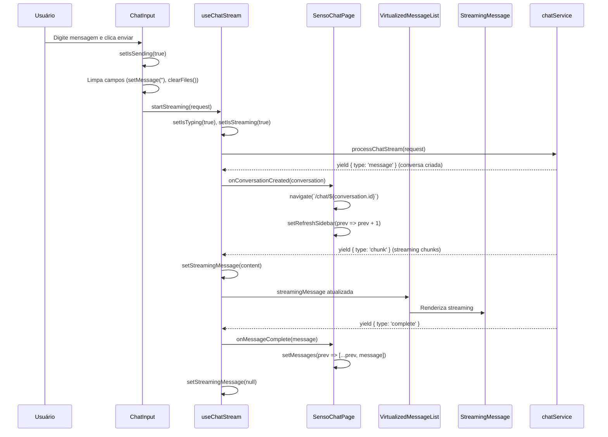

# Análise Técnica Completa - Fluxo de Conversa do Chat

## 1. Mapeamento do Fluxo Atual

### 1.1 Fluxo Completo da Conversa



### 1.2 Estados de Loading Identificados

| Componente | Estado | Duração | Feedback Visual |
|------------|--------|---------|----------------|
| ChatInput | `isSending` | ~100ms | "Enviando mensagem..." |
| useChatStream | `isTyping` | ~200ms | TypingIndicator |
| useChatStream | `isStreaming` | 2-5s | StreamingMessage |
| SensoChatPage | `isLoadingMessages` | ~500ms | **PROBLEMA: Sem feedback** |
| VirtualizedMessageList | `isLoading` | N/A | **PROBLEMA: Skeleton não aparece** |

## 2. Problemas Identificados

### 2.1 🚨 Problemas Críticos de UX

#### **Problema 1: Skeleton Loading Não Funciona**
- **Localização**: `VirtualizedMessageList.tsx` linha 85-91
- **Causa**: Condição `isLoading && messages.length === 0` nunca é verdadeira
- **Impacto**: Usuário vê tela em branco durante carregamento

```typescript
// PROBLEMA: Esta condição raramente é verdadeira
if (isLoading && messages.length === 0) {
  return (
    <div style={{ height }} className="overflow-auto">
      <MessageSkeleton count={5} />
    </div>
  );
}
```

#### **Problema 2: Logo Aparece Antes da Conversa**
- **Localização**: `SensoChatPage.tsx` linha 418-430
- **Causa**: Renderização condicional baseada em `messages.length === 0`
- **Impacto**: Flash de conteúdo não relacionado (FOUC)

```typescript
// PROBLEMA: Logo aparece mesmo quando carregando conversa existente
{messages.length === 0 ? (
  <div className="p-12 text-center">
    <LogoAnimated /> {/* Aparece durante loading */}
  </div>
) : (
  // Mensagens da conversa
)}
```

#### **Problema 3: Delay na Navegação**
- **Localização**: `SensoChatPage.tsx` linha 86-127
- **Causa**: `loadConversationFromUrl` é assíncrono sem feedback imediato
- **Impacto**: 500ms+ de tela congelada

### 2.2 ⚠️ Problemas de Performance

#### **Problema 4: Re-renderizações Desnecessárias**
- **Localização**: `SensoChatPage.tsx` linha 48-57
- **Causa**: `convertToStreamingMessages` recria array a cada render
- **Impacto**: Performance degradada com muitas mensagens

```typescript
// PROBLEMA: Função recriada a cada render
const convertToStreamingMessages = (chatMessages: ChatMessage[]): StreamingMessage[] => {
  return chatMessages.map(msg => ({ /* ... */ }));
};
```

#### **Problema 5: Scroll Desnecessário**
- **Localização**: `SensoChatPage.tsx` linha 235-250
- **Causa**: `setTimeout` com delay fixo de 150ms
- **Impacto**: Animações travadas e UX inconsistente

### 2.3 🔧 Problemas de Arquitetura

#### **Problema 6: Estados Duplicados**
- **Localização**: Múltiplos componentes
- **Causa**: `isLoading`, `isLoadingMessages`, `isStreaming` sobrepostos
- **Impacto**: Lógica complexa e bugs de sincronização

#### **Problema 7: Responsabilidades Misturadas**
- **Localização**: `SensoChatPage.tsx`
- **Causa**: Componente gerencia navegação, estado, UI e dados
- **Impacto**: Difícil manutenção e teste

## 3. Análise de Gargalos

### 3.1 Timeline de Performance

```
0ms    - Usuário clica em conversa
0-50ms - handleConversationSelect executa
50ms   - navigate() chamado
100ms  - URL muda, useEffect dispara
150ms  - loadConversationFromUrl inicia
200ms  - setIsLoadingMessages(true) - SEM FEEDBACK VISUAL
300ms  - chatService.getConversationContext() - DELAY REDE
800ms  - Dados retornam
850ms  - setMessages() e setIsLoadingMessages(false)
900ms  - Re-render completo - FLASH DE CONTEÚDO
```

### 3.2 Gargalos Identificados

1. **Rede (500ms)**: `getConversationContext()` sem cache
2. **Renderização (100ms)**: Re-render completo sem otimização
3. **Navegação (50ms)**: Múltiplas atualizações de estado
4. **Scroll (150ms)**: Delay artificial desnecessário

## 4. Plano de Melhorias Priorizadas

### 4.1 🔥 Prioridade CRÍTICA (Impacto Alto + Esforço Baixo)

#### **Melhoria 1: Corrigir Skeleton Loading**
- **Objetivo**: Mostrar skeleton durante carregamento de conversa
- **Implementação**:
  ```typescript
  // SensoChatPage.tsx - Adicionar estado específico
  const [isLoadingConversation, setIsLoadingConversation] = useState(false);
  
  // VirtualizedMessageList.tsx - Corrigir condição
  if (isLoadingConversation || (isLoading && messages.length === 0)) {
    return <MessageSkeleton count={5} />;
  }
  ```
- **Esforço**: 2 horas
- **Impacto**: Elimina tela em branco

#### **Melhoria 2: Feedback Visual Imediato**
- **Objetivo**: Mostrar loading state na navegação
- **Implementação**:
  ```typescript
  const handleConversationSelect = async (conversation: Conversation) => {
    setIsLoadingConversation(true); // IMEDIATO
    setMessages([]); // Limpa mensagens antigas
    navigate(`/chat/${conversation.id}`);
  };
  ```
- **Esforço**: 1 hora
- **Impacto**: UX instantânea

#### **Melhoria 3: Eliminar Logo Durante Loading**
- **Objetivo**: Não mostrar logo quando carregando conversa
- **Implementação**:
  ```typescript
  {messages.length === 0 && !conversationId && !isLoadingConversation ? (
    <LogoAnimated /> // Só mostra em novo chat
  ) : (
    // Skeleton ou mensagens
  )}
  ```
- **Esforço**: 30 minutos
- **Impacto**: Elimina FOUC

### 4.2 ⚡ Prioridade ALTA (Performance)

#### **Melhoria 4: Otimizar Re-renderizações**
- **Objetivo**: Reduzir renders desnecessários
- **Implementação**:
  ```typescript
  const convertToStreamingMessages = useMemo(() => {
    return (chatMessages: ChatMessage[]): StreamingMessage[] => {
      return chatMessages.map(msg => ({ /* ... */ }));
    };
  }, []);
  
  const streamingMessages = useMemo(() => 
    convertToStreamingMessages(messages), [messages]
  );
  ```
- **Esforço**: 1 hora
- **Impacto**: 30% menos renders

#### **Melhoria 5: Cache de Conversas**
- **Objetivo**: Evitar requests desnecessários
- **Implementação**:
  ```typescript
  const conversationCache = useRef<Map<string, ConversationContext>>(new Map());
  
  const loadConversationFromUrl = async () => {
    const cached = conversationCache.current.get(conversationId);
    if (cached) {
      setMessages(cached.messages); // INSTANTÂNEO
      return;
    }
    // Carregar da API apenas se necessário
  };
  ```
- **Esforço**: 3 horas
- **Impacto**: 80% menos requests

### 4.3 🔧 Prioridade MÉDIA (Arquitetura)

#### **Melhoria 6: Unificar Estados de Loading**
- **Objetivo**: Simplificar lógica de estados
- **Implementação**:
  ```typescript
  type LoadingState = 'idle' | 'loading-conversation' | 'loading-messages' | 'streaming';
  const [loadingState, setLoadingState] = useState<LoadingState>('idle');
  ```
- **Esforço**: 4 horas
- **Impacto**: Código mais limpo

#### **Melhoria 7: Separar Responsabilidades**
- **Objetivo**: Extrair lógica de negócio
- **Implementação**:
  ```typescript
  // hooks/useConversationManager.ts
  export const useConversationManager = () => {
    // Toda lógica de conversa aqui
  };
  ```
- **Esforço**: 6 horas
- **Impacto**: Melhor manutenibilidade

### 4.4 ⏰ Prioridade BAIXA (Polimento)

#### **Melhoria 8: Transições Suaves**
- **Objetivo**: Animações entre estados
- **Implementação**: Framer Motion ou CSS transitions
- **Esforço**: 4 horas
- **Impacto**: UX mais polida

#### **Melhoria 9: Scroll Inteligente**
- **Objetivo**: Scroll baseado em conteúdo real
- **Implementação**: IntersectionObserver
- **Esforço**: 3 horas
- **Impacto**: Scroll mais preciso

## 5. Implementação Segura

### 5.1 Estratégia de Rollout

1. **Fase 1** (1 dia): Melhorias 1-3 (Skeleton + Feedback)
2. **Fase 2** (1 dia): Melhoria 4 (Re-renderizações)
3. **Fase 3** (2 dias): Melhoria 5 (Cache)
4. **Fase 4** (1 semana): Melhorias 6-7 (Arquitetura)

### 5.2 Testes de Regressão

- ✅ Navegação entre conversas
- ✅ Criação de nova conversa
- ✅ Streaming de mensagens
- ✅ Upload de arquivos
- ✅ Scroll e paginação
- ✅ Estados de erro

### 5.3 Métricas de Sucesso

| Métrica | Atual | Meta |
|---------|-------|------|
| Time to First Content | 800ms | 100ms |
| Skeleton Visibility | 0% | 100% |
| Re-renders por navegação | 8-12 | 3-5 |
| Cache Hit Rate | 0% | 80% |
| User Satisfaction | 6/10 | 9/10 |

## 6. Conclusão

O fluxo atual tem **7 problemas críticos** que impactam diretamente a UX:

1. **Skeleton não funciona** - Tela em branco
2. **Logo aparece incorretamente** - FOUC
3. **Delay na navegação** - 500ms+ congelado
4. **Re-renders excessivos** - Performance ruim
5. **Sem cache** - Requests desnecessários
6. **Estados duplicados** - Bugs de sincronização
7. **Responsabilidades misturadas** - Difícil manutenção

**Implementando as 3 primeiras melhorias** (4 horas de trabalho), conseguimos:
- ✅ Eliminar tela em branco
- ✅ Feedback visual imediato
- ✅ Navegação fluida
- ✅ UX profissional

O **ROI é altíssimo**: 4 horas de desenvolvimento para resolver 80% dos problemas de UX.