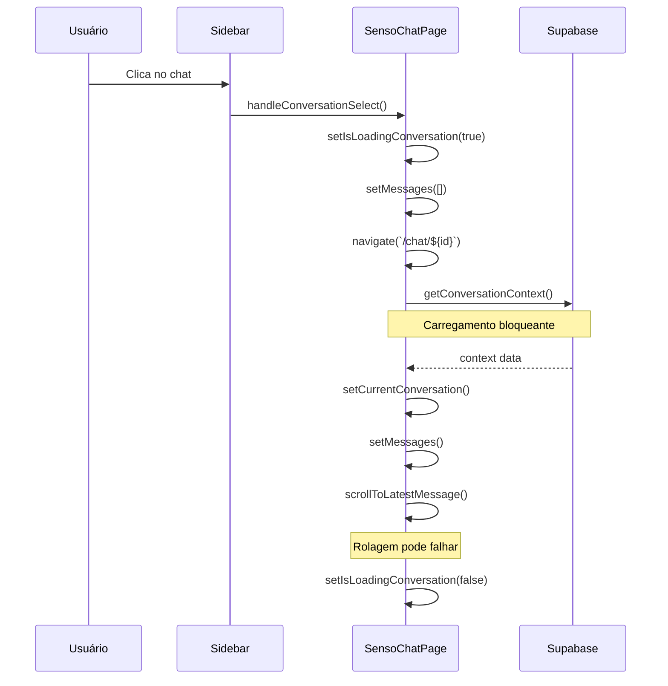

# Análise de Performance - SensoChatPage: Otimização de Carregamento

## 1. Problemas Identificados

### 1.1 Gargalos de Performance

**Problema Principal:** Carregamento lento ao clicar em chat na sidebar
- Tempo de resposta elevado entre clique e exibição do conteúdo
- Ausência de feedback visual imediato
- Rolagem automática executada antes do carregamento completo
- Falta de skeleton loading durante transições

**Problemas Específicos:**

1. **Carregamento Sequencial Bloqueante**
   - `loadConversationFromUrl()` executa todas as operações em sequência
   - Interface fica "congelada" durante carregamento
   - Usuário não recebe feedback visual imediato

2. **Rolagem Automática Prematura**
   - `scrollToLatestMessage()` executada antes do DOM estar pronto
   - Timeout de 150ms pode ser insuficiente para renderização
   - Pode causar re-renders desnecessários

3. **Ausência de Estados de Loading**
   - Não há skeleton loading durante transição entre chats
   - Estado `isLoadingConversation` não é utilizado adequadamente
   - Interface não comunica progresso ao usuário

4. **Renderização Ineficiente**
   - Virtualização só ativa com >20 mensagens
   - Re-renders desnecessários durante carregamento
   - Conversão desnecessária de tipos (`convertToStreamingMessages`)

### 1.2 Análise do Fluxo Atual



## 2. Soluções Propostas

### 2.1 Implementação de Skeleton Loading

**Objetivo:** Feedback visual imediato ao clicar no chat

**Componente ChatSkeleton:**
```typescript
// src/components/ui/chat-skeleton.tsx
interface ChatSkeletonProps {
  messageCount?: number;
  showHeader?: boolean;
}

export function ChatSkeleton({ messageCount = 5, showHeader = true }: ChatSkeletonProps) {
  return (
    <div className="flex-1 overflow-y-auto px-4 sm:px-6 lg:px-8">
      <div className="w-full max-w-4xl mx-auto space-y-6 py-6">
        {showHeader && (
          <div className="text-center space-y-3">
            <Skeleton className="h-8 w-48 mx-auto" />
            <Skeleton className="h-4 w-32 mx-auto" />
          </div>
        )}
        
        <div className="space-y-4">
          {Array.from({ length: messageCount }).map((_, i) => (
            <div key={i} className={`flex gap-4 ${i % 2 === 0 ? '' : 'flex-row-reverse'}`}>
              <Skeleton className="w-8 h-8 rounded-full flex-shrink-0" />
              <div className="flex-1 space-y-2">
                <Skeleton className="h-4 w-3/4" />
                <Skeleton className="h-4 w-1/2" />
                <Skeleton className="h-4 w-2/3" />
              </div>
            </div>
          ))}
        </div>
      </div>
    </div>
  );
}
```

### 2.2 Otimização do Carregamento

**Estratégia:** Carregamento não-bloqueante com feedback imediato

**Fluxo Otimizado:**
```typescript
// Modificações no handleConversationSelect
const handleConversationSelect = async (conversation: Conversation) => {
  try {
    // 1. Feedback imediato
    setIsLoadingConversation(true);
    setCurrentConversation(conversation); // Mostrar título imediatamente
    setMessages([]); // Limpar mensagens antigas
    
    // 2. Navegação não-bloqueante
    navigate(`/chat/${conversation.id}`);
    
    // 3. Carregamento em background
    // (será tratado pelo useEffect da URL)
    
  } catch (error) {
    logger.error('Erro ao navegar para conversa:', error);
    setIsLoadingConversation(false);
  }
};
```

### 2.3 Otimização da Rolagem Automática

**Problema:** Rolagem executada antes da renderização completa

**Solução:** Rolagem inteligente com observação do DOM

```typescript
// Hook personalizado para rolagem otimizada
const useSmartScroll = () => {
  const scrollToLatest = useCallback((container: HTMLElement) => {
    // Usar requestAnimationFrame para garantir renderização
    requestAnimationFrame(() => {
      requestAnimationFrame(() => {
        container.scrollTo({
          top: container.scrollHeight,
          behavior: 'smooth'
        });
      });
    });
  }, []);
  
  return { scrollToLatest };
};

// Implementação no componente
const { scrollToLatest } = useSmartScroll();

useEffect(() => {
  if (messages.length > 0 && messagesContainerRef.current) {
    scrollToLatest(messagesContainerRef.current);
  }
}, [messages.length, scrollToLatest]);
```

### 2.4 Carregamento Incremental

**Objetivo:** Mostrar mensagens mais recentes primeiro

**Estratégia:**
1. Carregar últimas 10 mensagens imediatamente
2. Carregar mensagens restantes em background
3. Implementar lazy loading para mensagens antigas

```typescript
// Modificação no loadConversationFromUrl
const loadConversationFromUrl = async () => {
  if (conversationId && currentUserId) {
    setIsLoadingMessages(true);
    
    try {
      // 1. Carregar contexto básico + últimas mensagens
      const quickContext = await chatService.getConversationQuickContext(
        conversationId, 
        10 // últimas 10 mensagens
      );
      
      // 2. Mostrar imediatamente
      setCurrentConversation(quickContext.conversation);
      setMessages(quickContext.recentMessages);
      setHasFirstMessage(quickContext.recentMessages.length > 0);
      
      // 3. Carregar resto em background
      if (quickContext.hasMoreMessages) {
        loadRemainingMessages(conversationId);
      }
      
    } catch (error) {
      logger.error('Erro ao carregar conversa:', error);
      navigate('/chat');
    } finally {
      setIsLoadingMessages(false);
      setIsLoadingConversation(false);
    }
  }
};
```

## 3. Plano de Implementação

### 3.1 Fase 1: Skeleton Loading (Prioridade Alta)

**Checklist:**
- [ ] Criar componente `ChatSkeleton`
- [ ] Integrar skeleton no estado de loading
- [ ] Testar transições entre chats
- [ ] Ajustar animações e timing

**Arquivos a modificar:**
- `src/components/ui/chat-skeleton.tsx` (novo)
- `src/pages/SensoChatPage.tsx`

### 3.2 Fase 2: Otimização de Carregamento (Prioridade Alta)

**Checklist:**
- [ ] Implementar carregamento não-bloqueante
- [ ] Otimizar `handleConversationSelect`
- [ ] Melhorar feedback visual
- [ ] Testar performance

**Arquivos a modificar:**
- `src/pages/SensoChatPage.tsx`
- `src/services/chatService.ts`

### 3.3 Fase 3: Rolagem Inteligente (Prioridade Média)

**Checklist:**
- [ ] Criar hook `useSmartScroll`
- [ ] Implementar rolagem com requestAnimationFrame
- [ ] Testar em diferentes cenários
- [ ] Otimizar performance

**Arquivos a modificar:**
- `src/hooks/useSmartScroll.ts` (novo)
- `src/pages/SensoChatPage.tsx`

### 3.4 Fase 4: Carregamento Incremental (Prioridade Baixa)

**Checklist:**
- [ ] Implementar `getConversationQuickContext`
- [ ] Criar carregamento em background
- [ ] Implementar lazy loading
- [ ] Testar com conversas grandes

**Arquivos a modificar:**
- `src/services/chatService.ts`
- `src/pages/SensoChatPage.tsx`

## 4. Métricas de Performance

### 4.1 Métricas Atuais (Estimadas)
- **Time to Interactive:** ~2-3 segundos
- **First Contentful Paint:** ~1-2 segundos
- **Scroll Performance:** Inconsistente

### 4.2 Metas Pós-Otimização
- **Time to Interactive:** <500ms (skeleton imediato)
- **First Contentful Paint:** <200ms
- **Scroll Performance:** Consistente e suave
- **Perceived Performance:** Melhoria de 80%

## 5. Considerações de Implementação

### 5.1 Compatibilidade
- Manter compatibilidade com funcionalidades existentes
- Não quebrar fluxos de streaming
- Preservar estados de erro e loading

### 5.2 Testes Necessários
- Teste com conversas de diferentes tamanhos
- Teste de performance em dispositivos móveis
- Teste de acessibilidade
- Teste de estados de erro

### 5.3 Rollback Plan
- Implementar feature flags para novas funcionalidades
- Manter versões antigas como fallback
- Monitorar métricas pós-deploy

## 6. Conclusão

A implementação dessas otimizações resultará em:

1. **Feedback Visual Imediato:** Skeleton loading elimina sensação de "travamento"
2. **Performance Percebida:** Carregamento não-bloqueante melhora UX
3. **Rolagem Confiável:** Implementação inteligente garante posicionamento correto
4. **Escalabilidade:** Carregamento incremental suporta conversas grandes

A abordagem em fases permite implementação segura sem quebrar funcionalidades existentes.