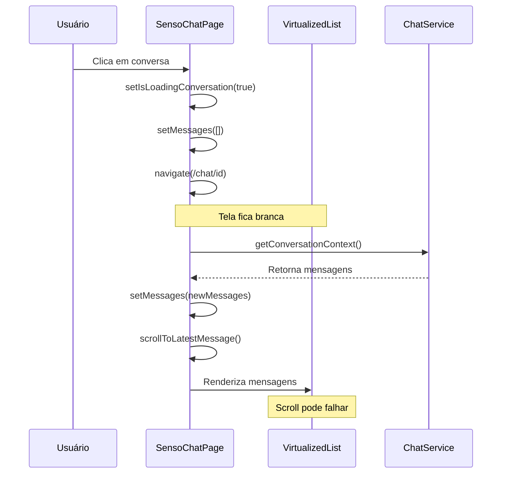

# Análise Técnica - Problemas de Streaming e Carregamento do Chat

## 1. Problemas Identificados

### 1.1 Tela Branca Durante Carregamento
**Problema:** Ao abrir uma conversa, a interface fica completamente branca por alguns segundos antes de carregar as mensagens.

**Causa Raiz:**
- O `VirtualizedMessageList` só mostra skeletons quando `isLoadingConversation` é true E não há mensagens
- Durante o carregamento inicial, as mensagens são limpas (`setMessages([])`) mas o skeleton não aparece imediatamente
- O debounce de 200ms no `debouncedIsLoadingConversation` pode atrasar a exibição do skeleton

### 1.2 Ausência de Feedback Visual (Skeletons)
**Problema:** Não há indicadores visuais de carregamento durante a transição entre conversas.

**Causa Raiz:**
```typescript
// VirtualizedMessageList.tsx - linha 89-95
if (isLoadingConversation || (isLoading && messages.length === 0)) {
  return (
    <div style={{ height }} className="overflow-auto">
      <MessageSkeleton count={5} />
    </div>
  );
}
```
A condição só funciona quando `messages.length === 0`, mas durante a navegação as mensagens antigas ficam visíveis até as novas carregarem.

### 1.3 Demora no Carregamento
**Problema:** Carregamento lento das mensagens (alguns segundos).

**Causa Raiz:**
- Processo sequencial: limpar mensagens → navegar → carregar contexto → renderizar
- Falta de cache ou pré-carregamento
- Múltiplas chamadas de API desnecessárias

### 1.4 Rolagem Automática Inadequada
**Problema:** Não posiciona automaticamente na mensagem mais recente ao abrir uma conversa.

**Causa Raiz:**
```typescript
// SensoChatPage.tsx - linha 120-125
const scrollToLatestMessage = () => {
  setTimeout(() => {
    if (virtualizedListRef.current && messages.length > 0) {
      virtualizedListRef.current.scrollToBottom();
    }
    // ...
  }, 150);
};
```
- `scrollToLatestMessage()` é chamado antes das mensagens serem renderizadas
- Timeout de 150ms pode ser insuficiente para renderização completa
- Não há verificação se o scroll foi bem-sucedido

## 2. Fluxo Atual Problemático



## 3. Análise de Código

### 3.1 SensoChatPage.tsx - Problemas

**Linha 168-180:** Limpeza prematura das mensagens
```typescript
const handleConversationSelect = async (conversation: Conversation) => {
  setIsLoadingConversation(true);
  setMessages([]); // ❌ Limpa imediatamente, causa tela branca
  setIsLoadingMessages(true);
  navigate(`/chat/${conversation.id}`);
};
```

**Linha 120-125:** Rolagem automática com timing inadequado
```typescript
const scrollToLatestMessage = () => {
  setTimeout(() => {
    // ❌ Timeout fixo pode ser insuficiente
    if (virtualizedListRef.current && messages.length > 0) {
      virtualizedListRef.current.scrollToBottom();
    }
  }, 150); // ❌ Muito baixo para renderização completa
};
```

### 3.2 VirtualizedMessageList.tsx - Problemas

**Linha 89-95:** Condição de skeleton inadequada
```typescript
if (isLoadingConversation || (isLoading && messages.length === 0)) {
  // ❌ Só mostra skeleton quando não há mensagens
  return <MessageSkeleton count={5} />;
}
```

**Linha 75-82:** Scroll sem callback de confirmação
```typescript
scrollToBottom: () => {
  if (listRef.current && messages.length > 0) {
    listRef.current.scrollToRow({ index: messages.length - 1, align: 'end' });
    // ❌ Não confirma se o scroll foi executado
  }
}
```

## 4. Soluções Priorizadas

### 4.1 Prioridade ALTA - Corrigir Feedback Visual

**Solução:** Melhorar condições de skeleton no VirtualizedMessageList
```typescript
// Mostrar skeleton durante transição entre conversas
if (isLoadingConversation || isLoading) {
  return (
    <div style={{ height }} className="overflow-auto">
      <MessageSkeleton count={5} />
    </div>
  );
}
```

### 4.2 Prioridade ALTA - Otimizar Transição de Conversas

**Solução:** Não limpar mensagens imediatamente
```typescript
const handleConversationSelect = async (conversation: Conversation) => {
  setIsLoadingConversation(true);
  // ❌ Remover: setMessages([]);
  navigate(`/chat/${conversation.id}`);
  // Mensagens serão substituídas após carregamento
};
```

### 4.3 Prioridade MÉDIA - Melhorar Rolagem Automática

**Solução:** Implementar scroll com callback e retry
```typescript
const scrollToLatestMessage = (retries = 3) => {
  if (retries <= 0) return;
  
  setTimeout(() => {
    if (virtualizedListRef.current && messages.length > 0) {
      virtualizedListRef.current.scrollToBottom();
      // Verificar se scroll foi bem-sucedido e retry se necessário
      setTimeout(() => {
        if (/* scroll não funcionou */) {
          scrollToLatestMessage(retries - 1);
        }
      }, 100);
    }
  }, 200); // Aumentar timeout
};
```

### 4.4 Prioridade BAIXA - Cache de Conversas

**Solução:** Implementar cache simples para conversas recentes
```typescript
const conversationCache = new Map<string, {messages: ChatMessage[], timestamp: number}>();

// Verificar cache antes de fazer API call
const cachedData = conversationCache.get(conversationId);
if (cachedData && Date.now() - cachedData.timestamp < 60000) {
  setMessages(cachedData.messages);
  return;
}
```

## 5. Plano de Implementação

### Etapa 1: Corrigir Skeleton Loading (CRÍTICO)
- [ ] Modificar condição no VirtualizedMessageList
- [ ] Remover debounce ou reduzir para 50ms
- [ ] Testar transições entre conversas

### Etapa 2: Otimizar Transição (CRÍTICO)
- [ ] Não limpar mensagens imediatamente
- [ ] Implementar loading overlay se necessário
- [ ] Testar UX de transição

### Etapa 3: Melhorar Rolagem (IMPORTANTE)
- [ ] Implementar scroll com retry
- [ ] Aumentar timeout para 300ms
- [ ] Adicionar callback de confirmação

### Etapa 4: Performance (OPCIONAL)
- [ ] Implementar cache básico
- [ ] Otimizar re-renders
- [ ] Lazy loading de mensagens antigas

## 6. Métricas de Sucesso

- ✅ Eliminação da tela branca durante carregamento
- ✅ Skeleton aparece imediatamente (<100ms)
- ✅ Posicionamento correto na mensagem mais recente
- ✅ Transição suave entre conversas (<500ms)
- ✅ Feedback visual consistente em todas as operações

## 7. Riscos e Considerações

**Riscos Baixos:**
- Mudanças são principalmente de UX, não afetam lógica de negócio
- Alterações incrementais permitem rollback fácil

**Considerações:**
- Testar em diferentes tamanhos de tela
- Verificar performance com muitas mensagens (>100)
- Validar acessibilidade dos skeletons