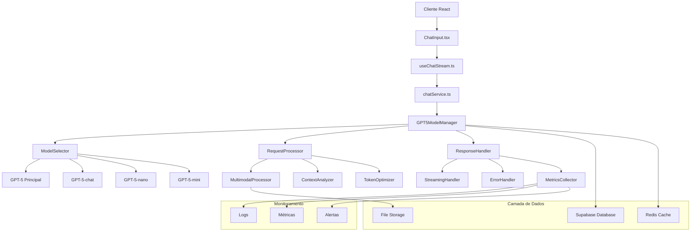
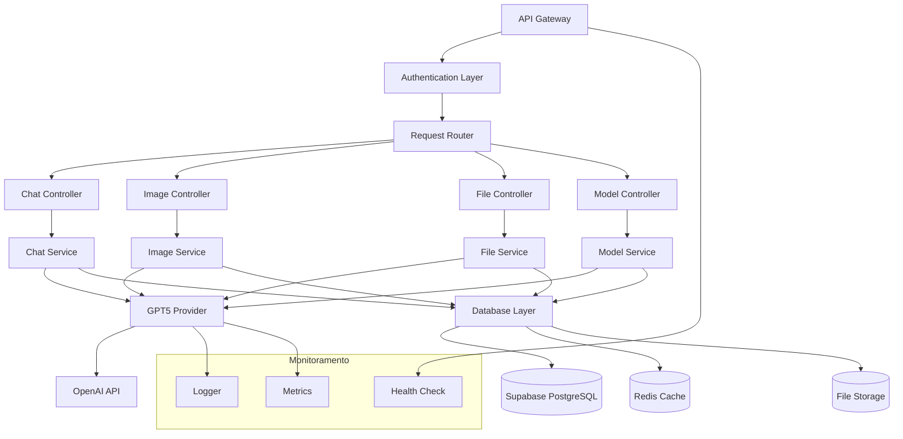
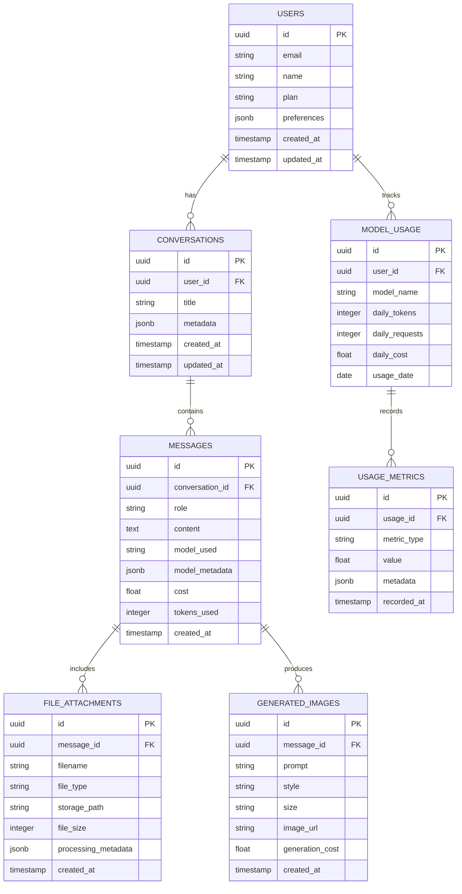

# Arquitetura Técnica - Implementação GPT-5

## 1. Arquitetura do Sistema



## 2. Descrição Tecnológica

- **Frontend**: React@18 + TypeScript + Tailwind CSS + Vite
- **Backend**: Supabase (Database + Storage + Auth)
- **Cache**: Redis (para otimização de respostas)
- **AI Models**: OpenAI GPT-5 (4 variantes)
- **Monitoramento**: Custom logging + métricas
- **Deployment**: Vercel (Frontend) + Supabase (Backend)

## 3. Definições de Rotas

| Rota | Propósito | Modelo Padrão |
|------|-----------|---------------|
| `/chat` | Interface principal de chat | GPT-5-chat |
| `/chat/advanced` | Chat com recursos avançados | GPT-5 |
| `/chat/quick` | Respostas rápidas | GPT-5-nano |
| `/image/generate` | Geração de imagens | GPT-5 |
| `/file/analyze` | Análise de documentos | GPT-5 |
| `/api/models/select` | Seleção automática de modelo | N/A |

## 4. Definições de API

### 4.1 Core API - Seleção de Modelo

**Endpoint de Seleção Automática**
```
POST /api/models/select
```

**Request:**
| Parâmetro | Tipo | Obrigatório | Descrição |
|-----------|------|-------------|----------|
| message | string | true | Mensagem do usuário |
| files | File[] | false | Arquivos anexados |
| conversationHistory | Message[] | false | Histórico da conversa |
| userPlan | string | true | Plano do usuário (free/premium/enterprise) |
| preferredSpeed | string | false | Preferência de velocidade (fast/balanced/quality) |

**Response:**
| Parâmetro | Tipo | Descrição |
|-----------|------|----------|
| selectedModel | string | Modelo selecionado |
| reasoning | string | Justificativa da seleção |
| estimatedCost | number | Custo estimado em tokens |
| estimatedTime | number | Tempo estimado em segundos |

**Exemplo:**
```json
{
  "message": "Analise este PDF sobre vendas",
  "files": ["relatorio_vendas.pdf"],
  "userPlan": "premium",
  "preferredSpeed": "quality"
}
```

**Response:**
```json
{
  "selectedModel": "gpt-5",
  "reasoning": "Documento complexo requer análise multimodal avançada",
  "estimatedCost": 0.15,
  "estimatedTime": 8
}
```

### 4.2 API de Chat Multimodal

**Endpoint de Chat**
```
POST /api/chat/completions
```

**Request:**
| Parâmetro | Tipo | Obrigatório | Descrição |
|-----------|------|-------------|----------|
| model | string | false | Modelo específico (auto-seleção se omitido) |
| messages | Message[] | true | Array de mensagens |
| files | FileAttachment[] | false | Arquivos multimodais |
| stream | boolean | false | Resposta em streaming |
| maxTokens | number | false | Limite de tokens |
| temperature | number | false | Criatividade (0.0-2.0) |

**Response (Streaming):**
```json
{
  "id": "chatcmpl-123",
  "object": "chat.completion.chunk",
  "model": "gpt-5-chat",
  "choices": [{
    "delta": {
      "content": "Analisando o documento..."
    },
    "finish_reason": null
  }]
}
```

### 4.3 API de Geração de Imagens

**Endpoint de Geração**
```
POST /api/images/generate
```

**Request:**
| Parâmetro | Tipo | Obrigatório | Descrição |
|-----------|------|-------------|----------|
| prompt | string | true | Descrição da imagem |
| style | string | false | Estilo (photorealistic/artistic/diagram) |
| size | string | false | Tamanho (1024x1024/1792x1024/1024x1792) |
| quality | string | false | Qualidade (standard/hd) |
| contextImages | string[] | false | URLs de imagens de referência |

**Response:**
```json
{
  "imageUrl": "https://storage.supabase.co/...",
  "prompt": "Logo moderno para empresa de tecnologia",
  "style": "artistic",
  "generationTime": 12.5,
  "cost": 0.08
}
```

## 5. Arquitetura do Servidor



## 6. Modelo de Dados

### 6.1 Definição do Modelo de Dados



### 6.2 Data Definition Language

**Tabela de Uso de Modelos (model_usage)**
```sql
-- Criar tabela de uso de modelos
CREATE TABLE model_usage (
    id UUID PRIMARY KEY DEFAULT gen_random_uuid(),
    user_id UUID NOT NULL REFERENCES users(id) ON DELETE CASCADE,
    model_name VARCHAR(50) NOT NULL,
    daily_tokens INTEGER DEFAULT 0,
    daily_requests INTEGER DEFAULT 0,
    daily_cost DECIMAL(10,4) DEFAULT 0.00,
    usage_date DATE NOT NULL DEFAULT CURRENT_DATE,
    created_at TIMESTAMP WITH TIME ZONE DEFAULT NOW(),
    updated_at TIMESTAMP WITH TIME ZONE DEFAULT NOW(),
    
    UNIQUE(user_id, model_name, usage_date)
);

-- Índices para performance
CREATE INDEX idx_model_usage_user_date ON model_usage(user_id, usage_date);
CREATE INDEX idx_model_usage_model_date ON model_usage(model_name, usage_date);
CREATE INDEX idx_model_usage_cost ON model_usage(daily_cost DESC);

-- Tabela de imagens geradas (generated_images)
CREATE TABLE generated_images (
    id UUID PRIMARY KEY DEFAULT gen_random_uuid(),
    message_id UUID NOT NULL REFERENCES messages(id) ON DELETE CASCADE,
    prompt TEXT NOT NULL,
    style VARCHAR(50) DEFAULT 'photorealistic',
    size VARCHAR(20) DEFAULT '1024x1024',
    image_url TEXT NOT NULL,
    generation_cost DECIMAL(8,4) DEFAULT 0.00,
    generation_time DECIMAL(6,2) DEFAULT 0.00,
    created_at TIMESTAMP WITH TIME ZONE DEFAULT NOW()
);

-- Índices para imagens
CREATE INDEX idx_generated_images_message ON generated_images(message_id);
CREATE INDEX idx_generated_images_created ON generated_images(created_at DESC);

-- Tabela de métricas de uso (usage_metrics)
CREATE TABLE usage_metrics (
    id UUID PRIMARY KEY DEFAULT gen_random_uuid(),
    usage_id UUID NOT NULL REFERENCES model_usage(id) ON DELETE CASCADE,
    metric_type VARCHAR(50) NOT NULL, -- 'response_time', 'satisfaction', 'error_rate'
    value DECIMAL(10,4) NOT NULL,
    metadata JSONB DEFAULT '{}',
    recorded_at TIMESTAMP WITH TIME ZONE DEFAULT NOW()
);

-- Índices para métricas
CREATE INDEX idx_usage_metrics_type ON usage_metrics(metric_type);
CREATE INDEX idx_usage_metrics_recorded ON usage_metrics(recorded_at DESC);

-- Atualizar tabela de mensagens para GPT-5
ALTER TABLE messages 
ADD COLUMN IF NOT EXISTS model_used VARCHAR(50) DEFAULT 'gpt-4o',
ADD COLUMN IF NOT EXISTS model_metadata JSONB DEFAULT '{}',
ADD COLUMN IF NOT EXISTS cost DECIMAL(8,4) DEFAULT 0.00,
ADD COLUMN IF NOT EXISTS tokens_used INTEGER DEFAULT 0,
ADD COLUMN IF NOT EXISTS response_time DECIMAL(6,2) DEFAULT 0.00;

-- Índices para mensagens atualizadas
CREATE INDEX IF NOT EXISTS idx_messages_model_used ON messages(model_used);
CREATE INDEX IF NOT EXISTS idx_messages_cost ON messages(cost DESC);
CREATE INDEX IF NOT EXISTS idx_messages_tokens ON messages(tokens_used DESC);

-- Atualizar tabela de anexos para metadados de processamento
ALTER TABLE file_attachments 
ADD COLUMN IF NOT EXISTS processing_metadata JSONB DEFAULT '{}',
ADD COLUMN IF NOT EXISTS processing_status VARCHAR(20) DEFAULT 'pending';

-- Função para calcular custos automaticamente
CREATE OR REPLACE FUNCTION calculate_model_cost(
    model_name VARCHAR(50),
    input_tokens INTEGER,
    output_tokens INTEGER
) RETURNS DECIMAL(8,4) AS $$
DECLARE
    input_cost DECIMAL(8,6);
    output_cost DECIMAL(8,6);
    total_cost DECIMAL(8,4);
BEGIN
    -- Custos por 1M tokens (valores de exemplo)
    CASE model_name
        WHEN 'gpt-5' THEN
            input_cost := 15.00;
            output_cost := 60.00;
        WHEN 'gpt-5-chat' THEN
            input_cost := 5.00;
            output_cost := 15.00;
        WHEN 'gpt-5-nano' THEN
            input_cost := 0.15;
            output_cost := 0.60;
        WHEN 'gpt-5-mini' THEN
            input_cost := 1.50;
            output_cost := 6.00;
        ELSE
            input_cost := 5.00;
            output_cost := 15.00;
    END CASE;
    
    total_cost := (input_tokens * input_cost / 1000000.0) + (output_tokens * output_cost / 1000000.0);
    RETURN ROUND(total_cost, 4);
END;
$$ LANGUAGE plpgsql;

-- Trigger para atualizar uso diário automaticamente
CREATE OR REPLACE FUNCTION update_daily_usage()
RETURNS TRIGGER AS $$
BEGIN
    INSERT INTO model_usage (user_id, model_name, daily_tokens, daily_requests, daily_cost, usage_date)
    VALUES (
        (SELECT user_id FROM conversations WHERE id = NEW.conversation_id),
        NEW.model_used,
        NEW.tokens_used,
        1,
        NEW.cost,
        CURRENT_DATE
    )
    ON CONFLICT (user_id, model_name, usage_date)
    DO UPDATE SET
        daily_tokens = model_usage.daily_tokens + NEW.tokens_used,
        daily_requests = model_usage.daily_requests + 1,
        daily_cost = model_usage.daily_cost + NEW.cost,
        updated_at = NOW();
    
    RETURN NEW;
END;
$$ LANGUAGE plpgsql;

CREATE TRIGGER trigger_update_daily_usage
    AFTER INSERT ON messages
    FOR EACH ROW
    WHEN (NEW.model_used IS NOT NULL AND NEW.tokens_used > 0)
    EXECUTE FUNCTION update_daily_usage();

-- Dados iniciais para configuração
INSERT INTO model_usage (user_id, model_name, daily_tokens, daily_requests, daily_cost, usage_date)
SELECT 
    u.id,
    model.name,
    0,
    0,
    0.00,
    CURRENT_DATE
FROM users u
CROSS JOIN (
    VALUES 
    ('gpt-5'),
    ('gpt-5-chat'),
    ('gpt-5-nano'),
    ('gpt-5-mini')
) AS model(name)
ON CONFLICT (user_id, model_name, usage_date) DO NOTHING;

-- Configurar RLS (Row Level Security)
ALTER TABLE model_usage ENABLE ROW LEVEL SECURITY;
ALTER TABLE generated_images ENABLE ROW LEVEL SECURITY;
ALTER TABLE usage_metrics ENABLE ROW LEVEL SECURITY;

-- Políticas de segurança
CREATE POLICY "Users can view their own model usage" ON model_usage
    FOR SELECT USING (user_id = auth.uid());

CREATE POLICY "Users can view their own generated images" ON generated_images
    FOR SELECT USING (
        message_id IN (
            SELECT m.id FROM messages m
            JOIN conversations c ON m.conversation_id = c.id
            WHERE c.user_id = auth.uid()
        )
    );

CREATE POLICY "Users can view their own usage metrics" ON usage_metrics
    FOR SELECT USING (
        usage_id IN (
            SELECT id FROM model_usage WHERE user_id = auth.uid()
        )
    );

-- Grants para roles
GRANT SELECT ON model_usage TO authenticated;
GRANT SELECT ON generated_images TO authenticated;
GRANT SELECT ON usage_metrics TO authenticated;

GRANT ALL PRIVILEGES ON model_usage TO service_role;
GRANT ALL PRIVILEGES ON generated_images TO service_role;
GRANT ALL PRIVILEGES ON usage_metrics TO service_role;
```

## 7. Implementação Técnica Detalhada

### 7.1 GPT5ModelManager Class

```typescript
// lib/gpt5ModelManager.ts
import { OpenAI } from 'openai';

interface ModelConfig {
  name: string;
  maxTokens: number;
  costPerInputToken: number;
  costPerOutputToken: number;
  multimodalCapable: boolean;
  imageGenerationCapable: boolean;
  optimalFor: string[];
}

interface SelectionCriteria {
  taskComplexity: 'simple' | 'medium' | 'complex' | 'critical';
  hasMultimodal: boolean;
  conversationLength: number;
  responseTime: 'fast' | 'balanced' | 'quality';
  userPlan: 'free' | 'premium' | 'enterprise';
  estimatedTokens: number;
}

export class GPT5ModelManager {
  private openai: OpenAI;
  private models: Record<string, ModelConfig> = {
    'gpt-5': {
      name: 'gpt-5',
      maxTokens: 128000,
      costPerInputToken: 0.000015,
      costPerOutputToken: 0.00006,
      multimodalCapable: true,
      imageGenerationCapable: true,
      optimalFor: ['complex-analysis', 'multimodal', 'critical-tasks']
    },
    'gpt-5-chat': {
      name: 'gpt-5-chat',
      maxTokens: 32000,
      costPerInputToken: 0.000005,
      costPerOutputToken: 0.000015,
      multimodalCapable: true,
      imageGenerationCapable: false,
      optimalFor: ['conversation', 'interactive-chat', 'customer-support']
    },
    'gpt-5-nano': {
      name: 'gpt-5-nano',
      maxTokens: 4000,
      costPerInputToken: 0.00000015,
      costPerOutputToken: 0.0000006,
      multimodalCapable: false,
      imageGenerationCapable: false,
      optimalFor: ['simple-queries', 'classification', 'quick-responses']
    },
    'gpt-5-mini': {
      name: 'gpt-5-mini',
      maxTokens: 16000,
      costPerInputToken: 0.0000015,
      costPerOutputToken: 0.000006,
      multimodalCapable: true,
      imageGenerationCapable: false,
      optimalFor: ['general-purpose', 'coding', 'analysis']
    }
  };

  constructor(apiKey: string) {
    this.openai = new OpenAI({ apiKey });
  }

  selectOptimalModel(criteria: SelectionCriteria): ModelConfig {
    // Lógica de seleção baseada nos critérios
    if (criteria.userPlan === 'free' && criteria.taskComplexity === 'simple') {
      return this.models['gpt-5-nano'];
    }

    if (criteria.hasMultimodal && criteria.taskComplexity === 'complex') {
      return this.models['gpt-5'];
    }

    if (criteria.conversationLength > 5 && criteria.responseTime === 'fast') {
      return this.models['gpt-5-chat'];
    }

    if (criteria.estimatedTokens < 8000 && criteria.responseTime === 'fast') {
      return this.models['gpt-5-mini'];
    }

    // Default para uso geral
    return this.models['gpt-5-chat'];
  }

  async processMessage(
    messages: any[],
    files: File[] = [],
    selectedModel?: string
  ): Promise<{
    response: string;
    model: string;
    tokensUsed: number;
    cost: number;
    processingTime: number;
  }> {
    const startTime = Date.now();
    
    // Analisar critérios se modelo não especificado
    if (!selectedModel) {
      const criteria = this.analyzeCriteria(messages, files);
      const modelConfig = this.selectOptimalModel(criteria);
      selectedModel = modelConfig.name;
    }

    // Processar arquivos se necessário
    const processedMessages = await this.processMultimodalContent(messages, files);

    // Fazer chamada para OpenAI
    const completion = await this.openai.chat.completions.create({
      model: selectedModel,
      messages: processedMessages,
      stream: false,
      max_tokens: this.models[selectedModel].maxTokens
    });

    const processingTime = Date.now() - startTime;
    const tokensUsed = completion.usage?.total_tokens || 0;
    const cost = this.calculateCost(selectedModel, completion.usage);

    return {
      response: completion.choices[0].message.content || '',
      model: selectedModel,
      tokensUsed,
      cost,
      processingTime
    };
  }

  private analyzeCriteria(messages: any[], files: File[]): SelectionCriteria {
    const lastMessage = messages[messages.length - 1]?.content || '';
    const messageLength = lastMessage.length;
    const hasFiles = files.length > 0;
    
    // Análise de complexidade baseada em palavras-chave
    const complexKeywords = ['analise', 'compare', 'explique detalhadamente', 'desenvolva'];
    const simpleKeywords = ['o que é', 'sim ou não', 'resumo', 'rápido'];
    
    let taskComplexity: SelectionCriteria['taskComplexity'] = 'medium';
    
    if (simpleKeywords.some(keyword => lastMessage.toLowerCase().includes(keyword))) {
      taskComplexity = 'simple';
    } else if (complexKeywords.some(keyword => lastMessage.toLowerCase().includes(keyword))) {
      taskComplexity = 'complex';
    }

    return {
      taskComplexity,
      hasMultimodal: hasFiles,
      conversationLength: messages.length,
      responseTime: messageLength > 500 ? 'quality' : 'balanced',
      userPlan: 'premium', // Será obtido do contexto do usuário
      estimatedTokens: Math.ceil(messageLength * 1.3) // Estimativa baseada no tamanho
    };
  }

  private async processMultimodalContent(messages: any[], files: File[]): Promise<any[]> {
    if (files.length === 0) return messages;

    const lastMessage = messages[messages.length - 1];
    const content = [{ type: 'text', text: lastMessage.content }];

    // Processar cada arquivo
    for (const file of files) {
      if (file.type.startsWith('image/')) {
        // Imagens são enviadas diretamente
        const base64 = await this.fileToBase64(file);
        content.push({
          type: 'image_url',
          image_url: {
            url: `data:${file.type};base64,${base64}`
          }
        });
      } else {
        // Outros arquivos são processados nativamente pelo GPT-5
        const fileContent = await this.processFileNatively(file);
        content.push({
          type: 'text',
          text: `Arquivo: ${file.name}\n${fileContent}`
        });
      }
    }

    return [
      ...messages.slice(0, -1),
      { ...lastMessage, content }
    ];
  }

  private async processFileNatively(file: File): Promise<string> {
    // Com GPT-5, podemos enviar arquivos diretamente
    // Esta é uma implementação simplificada
    const arrayBuffer = await file.arrayBuffer();
    const base64 = Buffer.from(arrayBuffer).toString('base64');
    
    // O GPT-5 processará nativamente
    return `[ARQUIVO: ${file.name} - ${file.type} - ${file.size} bytes]\nConteúdo processado nativamente pelo GPT-5`;
  }

  private async fileToBase64(file: File): Promise<string> {
    return new Promise((resolve, reject) => {
      const reader = new FileReader();
      reader.onload = () => {
        const base64 = (reader.result as string).split(',')[1];
        resolve(base64);
      };
      reader.onerror = reject;
      reader.readAsDataURL(file);
    });
  }

  private calculateCost(model: string, usage: any): number {
    if (!usage) return 0;
    
    const config = this.models[model];
    const inputCost = (usage.prompt_tokens || 0) * config.costPerInputToken;
    const outputCost = (usage.completion_tokens || 0) * config.costPerOutputToken;
    
    return Math.round((inputCost + outputCost) * 10000) / 10000; // 4 casas decimais
  }

  async generateImage(prompt: string, options: {
    style?: string;
    size?: string;
    quality?: string;
  } = {}): Promise<{
    imageUrl: string;
    cost: number;
    generationTime: number;
  }> {
    const startTime = Date.now();
    
    // Usar GPT-5 para geração de imagens nativa
    const response = await this.openai.chat.completions.create({
      model: 'gpt-5',
      messages: [{
        role: 'user',
        content: `Gere uma imagem: ${prompt}`,
        // Configurações específicas para geração de imagem
        image_generation: {
          style: options.style || 'photorealistic',
          size: options.size || '1024x1024',
          quality: options.quality || 'standard'
        }
      }]
    });

    const generationTime = Date.now() - startTime;
    
    // Extrair URL da imagem da resposta
    const imageUrl = this.extractImageUrl(response);
    const cost = 0.08; // Custo estimado para geração de imagem

    return {
      imageUrl,
      cost,
      generationTime
    };
  }

  private extractImageUrl(response: any): string {
    // Implementação para extrair URL da imagem da resposta do GPT-5
    // Esta é uma implementação placeholder
    return response.choices[0]?.message?.image_url || '';
  }

  getModelStats(): Record<string, ModelConfig> {
    return { ...this.models };
  }

  async healthCheck(): Promise<boolean> {
    try {
      const response = await this.openai.chat.completions.create({
        model: 'gpt-5-nano',
        messages: [{ role: 'user', content: 'test' }],
        max_tokens: 5
      });
      return !!response.choices[0]?.message?.content;
    } catch (error) {
      console.error('GPT-5 Health Check Failed:', error);
      return false;
    }
  }
}
```

### 7.2 Integração com chatService.ts

```typescript
// services/chatService.ts - Atualização para GPT-5
import { GPT5ModelManager } from '../lib/gpt5ModelManager';

class ChatService {
  private gpt5Manager: GPT5ModelManager;

  constructor() {
    this.gpt5Manager = new GPT5ModelManager(process.env.OPENAI_GPT5_API_KEY!);
  }

  async sendMessage(
    conversationId: string,
    message: string,
    files: File[] = [],
    userId: string,
    preferredModel?: string
  ): Promise<{
    response: string;
    messageId: string;
    model: string;
    cost: number;
    tokensUsed: number;
  }> {
    try {
      // Obter histórico da conversa
      const conversation = await this.getConversation(conversationId);
      const messages = this.formatMessagesForGPT5(conversation.messages);

      // Processar com GPT-5
      const result = await this.gpt5Manager.processMessage(
        messages,
        files,
        preferredModel
      );

      // Salvar mensagem do usuário
      const userMessageId = await this.saveMessage({
        conversationId,
        role: 'user',
        content: message,
        files,
        userId
      });

      // Salvar resposta da IA
      const aiMessageId = await this.saveMessage({
        conversationId,
        role: 'assistant',
        content: result.response,
        modelUsed: result.model,
        cost: result.cost,
        tokensUsed: result.tokensUsed,
        responseTime: result.processingTime,
        userId
      });

      // Atualizar métricas de uso
      await this.updateUsageMetrics(userId, result.model, result.tokensUsed, result.cost);

      return {
        response: result.response,
        messageId: aiMessageId,
        model: result.model,
        cost: result.cost,
        tokensUsed: result.tokensUsed
      };

    } catch (error) {
      console.error('Erro no ChatService:', error);
      
      // Fallback para GPT-4o em caso de erro
      return await this.fallbackToGPT4o(conversationId, message, files, userId);
    }
  }

  private formatMessagesForGPT5(messages: any[]): any[] {
    return messages.map(msg => ({
      role: msg.role,
      content: msg.content,
      // Incluir metadados se necessário
      ...(msg.files && { files: msg.files })
    }));
  }

  private async updateUsageMetrics(
    userId: string,
    model: string,
    tokens: number,
    cost: number
  ): Promise<void> {
    // Atualizar tabela model_usage via trigger automático
    // Adicionar métricas específicas se necessário
    await supabase
      .from('usage_metrics')
      .insert({
        usage_id: await this.getOrCreateUsageRecord(userId, model),
        metric_type: 'api_call',
        value: 1,
        metadata: {
          tokens,
          cost,
          timestamp: new Date().toISOString()
        }
      });
  }

  async generateImage(
    prompt: string,
    userId: string,
    options: {
      style?: string;
      size?: string;
      quality?: string;
    } = {}
  ): Promise<{
    imageUrl: string;
    cost: number;
    generationTime: number;
  }> {
    try {
      const result = await this.gpt5Manager.generateImage(prompt, options);
      
      // Salvar imagem gerada no banco
      await supabase
        .from('generated_images')
        .insert({
          message_id: null, // Será associado à mensagem posteriormente
          prompt,
          style: options.style || 'photorealistic',
          size: options.size || '1024x1024',
          image_url: result.imageUrl,
          generation_cost: result.cost,
          generation_time: result.generationTime
        });

      // Atualizar métricas de uso
      await this.updateUsageMetrics(userId, 'gpt-5', 0, result.cost);

      return result;
    } catch (error) {
      console.error('Erro na geração de imagem:', error);
      throw new Error('Falha na geração de imagem');
    }
  }

  async getModelRecommendation(
    message: string,
    files: File[],
    userId: string
  ): Promise<{
    recommendedModel: string;
    reasoning: string;
    estimatedCost: number;
    estimatedTime: number;
  }> {
    // Analisar critérios
    const userPlan = await this.getUserPlan(userId);
    const criteria = {
      taskComplexity: this.analyzeTaskComplexity(message),
      hasMultimodal: files.length > 0,
      conversationLength: 1, // Será obtido do contexto
      responseTime: 'balanced' as const,
      userPlan,
      estimatedTokens: Math.ceil(message.length * 1.3)
    };

    const modelConfig = this.gpt5Manager.selectOptimalModel(criteria);
    
    return {
      recommendedModel: modelConfig.name,
      reasoning: this.generateRecommendationReasoning(modelConfig, criteria),
      estimatedCost: this.estimateCost(modelConfig, criteria.estimatedTokens),
      estimatedTime: this.estimateResponseTime(modelConfig, criteria)
    };
  }

  private analyzeTaskComplexity(message: string): 'simple' | 'medium' | 'complex' | 'critical' {
    const complexKeywords = ['analise', 'compare', 'explique detalhadamente', 'desenvolva', 'crie um plano'];
    const simpleKeywords = ['o que é', 'sim ou não', 'resumo', 'rápido', 'defina'];
    
    const lowerMessage = message.toLowerCase();
    
    if (simpleKeywords.some(keyword => lowerMessage.includes(keyword))) {
      return 'simple';
    }
    
    if (complexKeywords.some(keyword => lowerMessage.includes(keyword))) {
      return 'complex';
    }
    
    if (message.length > 1000) {
      return 'complex';
    }
    
    return 'medium';
  }

  private generateRecommendationReasoning(modelConfig: any, criteria: any): string {
    const reasons = [];
    
    if (criteria.hasMultimodal && modelConfig.multimodalCapable) {
      reasons.push('Suporte multimodal necessário');
    }
    
    if (criteria.taskComplexity === 'simple' && modelConfig.name === 'gpt-5-nano') {
      reasons.push('Tarefa simples, otimizado para velocidade');
    }
    
    if (criteria.taskComplexity === 'complex' && modelConfig.name === 'gpt-5') {
      reasons.push('Tarefa complexa requer modelo mais avançado');
    }
    
    return reasons.join(', ') || 'Modelo balanceado para uso geral';
  }

  private estimateCost(modelConfig: any, tokens: number): number {
    const inputCost = tokens * modelConfig.costPerInputToken;
    const outputCost = tokens * 0.5 * modelConfig.costPerOutputToken; // Estimativa de 50% do input
    return Math.round((inputCost + outputCost) * 10000) / 10000;
  }

  private estimateResponseTime(modelConfig: any, criteria: any): number {
    const baseTime = {
      'gpt-5': 8,
      'gpt-5-chat': 4,
      'gpt-5-nano': 1,
      'gpt-5-mini': 3
    }[modelConfig.name] || 5;
    
    const complexityMultiplier = {
      'simple': 0.5,
      'medium': 1,
      'complex': 1.5,
      'critical': 2
    }[criteria.taskComplexity] || 1;
    
    const multimodalMultiplier = criteria.hasMultimodal ? 1.5 : 1;
    
    return Math.round(baseTime * complexityMultiplier * multimodalMultiplier);
  }

  async getUsageStatistics(userId: string, period: 'day' | 'week' | 'month' = 'day'): Promise<{
    totalCost: number;
    totalTokens: number;
    totalRequests: number;
    modelBreakdown: Record<string, any>;
  }> {
    const { data, error } = await supabase
      .from('model_usage')
      .select('*')
      .eq('user_id', userId)
      .gte('usage_date', this.getDateRange(period))
      .order('usage_date', { ascending: false });

    if (error) throw error;

    const stats = data.reduce((acc, usage) => {
      acc.totalCost += usage.daily_cost;
      acc.totalTokens += usage.daily_tokens;
      acc.totalRequests += usage.daily_requests;
      
      if (!acc.modelBreakdown[usage.model_name]) {
        acc.modelBreakdown[usage.model_name] = {
          cost: 0,
          tokens: 0,
          requests: 0
        };
      }
      
      acc.modelBreakdown[usage.model_name].cost += usage.daily_cost;
      acc.modelBreakdown[usage.model_name].tokens += usage.daily_tokens;
      acc.modelBreakdown[usage.model_name].requests += usage.daily_requests;
      
      return acc;
    }, {
      totalCost: 0,
      totalTokens: 0,
      totalRequests: 0,
      modelBreakdown: {} as Record<string, any>
    });

    return stats;
  }

  private getDateRange(period: 'day' | 'week' | 'month'): string {
    const now = new Date();
    const days = {
      'day': 1,
      'week': 7,
      'month': 30
    }[period];
    
    const startDate = new Date(now.getTime() - (days * 24 * 60 * 60 * 1000));
    return startDate.toISOString().split('T')[0];
  }
}

export const chatService = new ChatService();
```

Esta arquitetura técnica fornece uma base sólida para implementar todos os modelos GPT-5 de forma eficiente, segura e escalável no SensoAI Labs Chat.