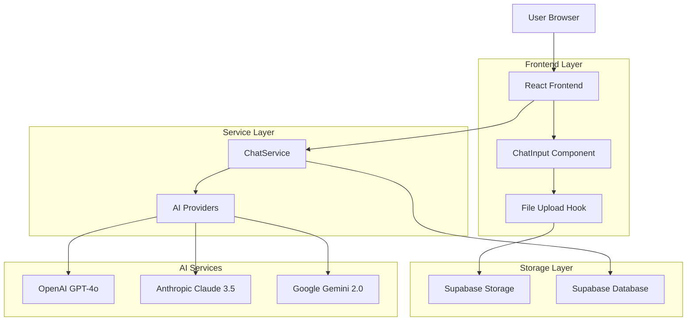
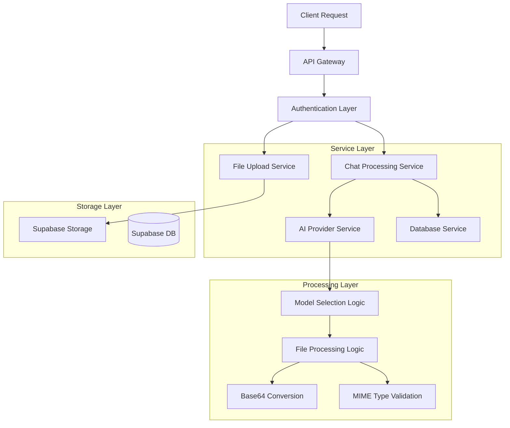
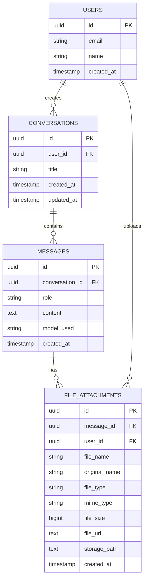

# Arquitetura Técnica: Funcionalidade Multimodal SensoChat

## 1. Arquitetura de Sistema



## 2. Tecnologias Utilizadas

* **Frontend**: React\@18 + TypeScript + TailwindCSS + Vite

* **Backend**: Supabase (Database + Storage + Auth)

* **AI Integration**: OpenAI API + Anthropic API + Google AI API

* **File Processing**: Base64 encoding + MIME type validation

* **Storage**: Supabase Storage com buckets seguros

## 3. Definições de Rotas

| Rota                    | Propósito                                       |
| ----------------------- | ----------------------------------------------- |
| `/chat`                 | Página principal do chat com upload de arquivos |
| `/chat/:conversationId` | Conversa específica com histórico de arquivos   |
| `/files/:fileId`        | Visualização/download de arquivo específico     |

## 4. Definições de API

### 4.1 APIs de Chat com Arquivos

#### Upload de Arquivo

```
POST /api/chat/upload
```

**Request:**

| Parâmetro      | Tipo   | Obrigatório | Descrição                 |
| -------------- | ------ | ----------- | ------------------------- |
| file           | File   | true        | Arquivo a ser enviado     |
| conversationId | string | false       | ID da conversa (opcional) |

**Response:**

| Parâmetro | Tipo   | Descrição              |
| --------- | ------ | ---------------------- |
| fileId    | string | ID único do arquivo    |
| fileName  | string | Nome do arquivo        |
| fileUrl   | string | URL pública do arquivo |
| fileSize  | number | Tamanho em bytes       |

**Exemplo:**

```json
{
  "fileId": "uuid-123",
  "fileName": "documento.pdf",
  "fileUrl": "https://supabase.co/storage/v1/object/public/chat-files/user123/documento.pdf",
  "fileSize": 1024000
}
```

#### Processamento de Chat com Arquivos

```
POST /api/chat/process
```

**Request:**

| Parâmetro       | Tipo              | Obrigatório | Descrição                  |
| --------------- | ----------------- | ----------- | -------------------------- |
| message         | string            | true        | Mensagem do usuário        |
| fileAttachments | FileAttachment\[] | false       | Lista de arquivos anexados |
| conversationId  | string            | false       | ID da conversa             |
| modelId         | string            | true        | ID do modelo de IA         |

**Response:**

| Parâmetro      | Tipo   | Descrição             |
| -------------- | ------ | --------------------- |
| response       | string | Resposta da IA        |
| messageId      | string | ID da mensagem criada |
| conversationId | string | ID da conversa        |

## 5. Arquitetura do Servidor



## 6. Modelo de Dados

### 6.1 Diagrama de Entidades



### 6.2 DDL - Definições de Tabelas

#### Tabela file\_attachments

```sql
-- Criar tabela de anexos
CREATE TABLE file_attachments (
    id UUID PRIMARY KEY DEFAULT gen_random_uuid(),
    message_id UUID REFERENCES messages(id) ON DELETE CASCADE,
    user_id UUID REFERENCES users(id) ON DELETE CASCADE,
    file_name VARCHAR(255) NOT NULL,
    original_name VARCHAR(255) NOT NULL,
    file_type VARCHAR(50) NOT NULL,
    mime_type VARCHAR(100) NOT NULL,
    file_size BIGINT NOT NULL,
    file_url TEXT NOT NULL,
    storage_path TEXT NOT NULL,
    created_at TIMESTAMP WITH TIME ZONE DEFAULT NOW(),
    updated_at TIMESTAMP WITH TIME ZONE DEFAULT NOW()
);

-- Índices para performance
CREATE INDEX idx_file_attachments_message_id ON file_attachments(message_id);
CREATE INDEX idx_file_attachments_user_id ON file_attachments(user_id);
CREATE INDEX idx_file_attachments_created_at ON file_attachments(created_at DESC);
CREATE INDEX idx_file_attachments_file_type ON file_attachments(file_type);

-- Trigger para atualizar updated_at
CREATE OR REPLACE FUNCTION update_file_attachments_updated_at()
RETURNS TRIGGER AS $$
BEGIN
    NEW.updated_at = NOW();
    RETURN NEW;
END;
$$ LANGUAGE plpgsql;

CREATE TRIGGER trigger_update_file_attachments_updated_at
    BEFORE UPDATE ON file_attachments
    FOR EACH ROW
    EXECUTE FUNCTION update_file_attachments_updated_at();
```

#### Configuração do Supabase Storage

```sql
-- Criar bucket para arquivos do chat
INSERT INTO storage.buckets (id, name, public, file_size_limit, allowed_mime_types)
VALUES (
    'chat-files',
    'chat-files',
    true,
    10485760, -- 10MB limit
    ARRAY[
        'image/jpeg',
        'image/png',
        'image/gif',
        'image/webp',
        'application/pdf',
        'text/plain',
        'application/msword',
        'application/vnd.openxmlformats-officedocument.wordprocessingml.document',
        'application/vnd.ms-excel',
        'application/vnd.openxmlformats-officedocument.spreadsheetml.sheet'
    ]
);

-- Políticas RLS para o bucket
CREATE POLICY "Users can upload their own files" ON storage.objects
FOR INSERT WITH CHECK (
    bucket_id = 'chat-files' AND 
    auth.uid()::text = (storage.foldername(name))[1]
);

CREATE POLICY "Users can view their own files" ON storage.objects
FOR SELECT USING (
    bucket_id = 'chat-files' AND 
    auth.uid()::text = (storage.foldername(name))[1]
);

CREATE POLICY "Users can delete their own files" ON storage.objects
FOR DELETE USING (
    bucket_id = 'chat-files' AND 
    auth.uid()::text = (storage.foldername(name))[1]
);
```

#### Políticas RLS para file\_attachments

```sql
-- Habilitar RLS
ALTER TABLE file_attachments ENABLE ROW LEVEL SECURITY;

-- Política para inserção (usuários autenticados podem inserir seus próprios arquivos)
CREATE POLICY "Users can insert their own file attachments" ON file_attachments
FOR INSERT WITH CHECK (auth.uid() = user_id);

-- Política para seleção (usuários podem ver seus próprios arquivos)
CREATE POLICY "Users can view their own file attachments" ON file_attachments
FOR SELECT USING (auth.uid() = user_id);

-- Política para atualização (usuários podem atualizar seus próprios arquivos)
CREATE POLICY "Users can update their own file attachments" ON file_attachments
FOR UPDATE USING (auth.uid() = user_id);

-- Política para exclusão (usuários podem deletar seus próprios arquivos)
CREATE POLICY "Users can delete their own file attachments" ON file_attachments
FOR DELETE USING (auth.uid() = user_id);
```

#### Dados Iniciais

```sql
-- Atualizar configurações de modelos para suporte multimodal
UPDATE model_configurations 
SET 
    supports_files = true,
    supported_file_types = ARRAY['image/jpeg', 'image/png', 'image/gif', 'image/webp', 'application/pdf']
WHERE model_id IN ('gpt-4o', 'claude-3-5-sonnet-20241022', 'gemini-2.0-flash-exp');

-- Configurações específicas por modelo
UPDATE model_configurations 
SET 
    max_file_size = 10485760, -- 10MB
    max_files_per_message = 5
WHERE supports_files = true;
```

## 7. Fluxo de Processamento de Arquivos

### 7.1 Upload de Arquivo

1. **Frontend**: Usuário seleciona arquivo
2. **Validação**: Tipo, tamanho e quantidade
3. **Upload**: Envio para Supabase Storage
4. **Metadados**: Salvamento na tabela file\_attachments
5. **URL**: Geração de URL pública
6. **Preview**: Exibição no chat

### 7.2 Processamento Multimodal

1. **Preparação**: Conversão de arquivo para base64
2. **Validação**: Verificação de suporte pelo modelo
3. **Prompt**: Adaptação do prompt para incluir arquivo
4. **API**: Envio para provedor de IA
5. **Resposta**: Processamento da resposta
6. **Salvamento**: Persistência da conversa

## 8. Configurações de Segurança

### 8.1 Validações de Arquivo

* **Tipos permitidos**: Imagens, PDFs, documentos de texto

* **Tamanho máximo**: 10MB por arquivo

* **Quantidade máxima**: 5 arquivos por mensagem

* **Scanning**: Validação de MIME type real

### 8.2 Políticas de Acesso

* **Isolamento por usuário**: Cada usuário acessa apenas seus arquivos

* **URLs temporárias**: Links com expiração para segurança

* **Autenticação obrigatória**: Todos os endpoints protegidos

## 9. Monitoramento e Logs

### 9.1 Métricas de Upload

* **Taxa de sucesso**: Uploads bem-sucedidos vs falhas

* **Tamanho médio**: Tamanho médio dos arquivos

* **Tipos mais usados**: Distribuição por tipo de arquivo

* **Tempo de processamento**: Latência de upload e processamento

### 9.2 Métricas de IA

* **Modelos mais usados**: Distribuição de uso por modelo

* **Taxa de erro**: Falhas na integração com APIs

* **Tempo de resposta**: Latência das respostas multimodais

* **Custos**: Tracking de tokens e custos por modelo

