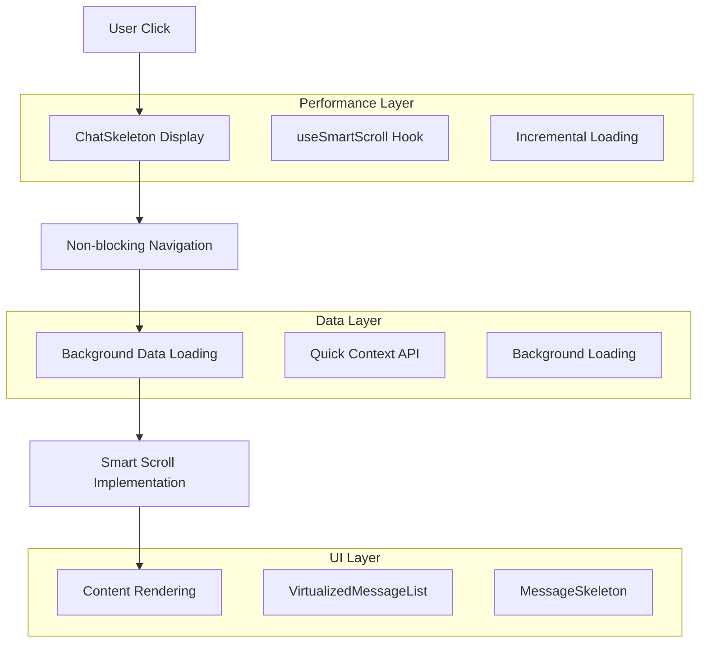
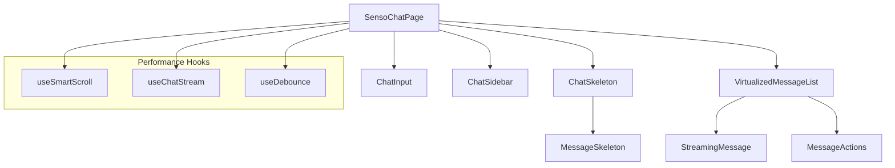
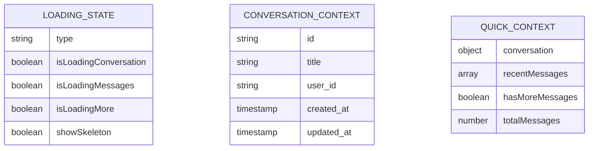
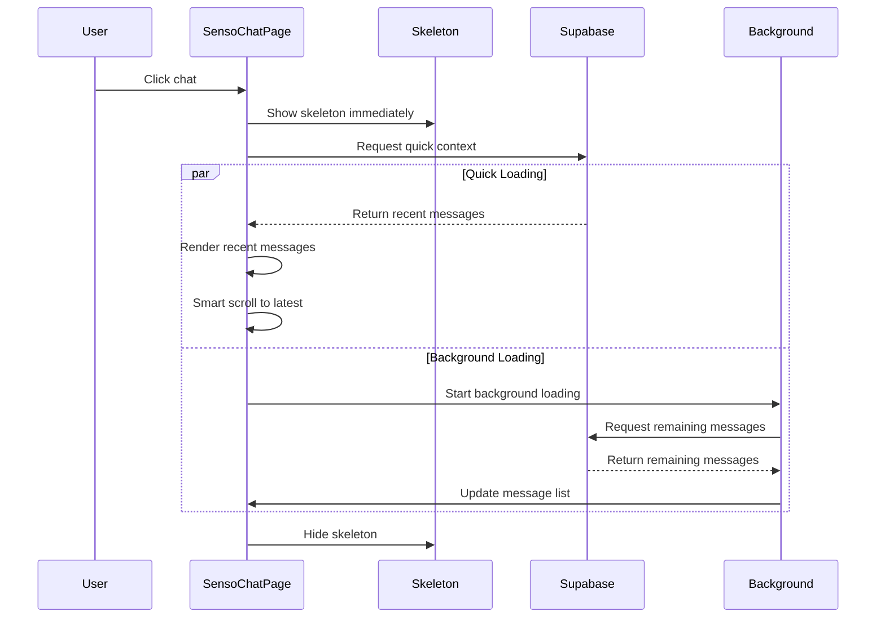
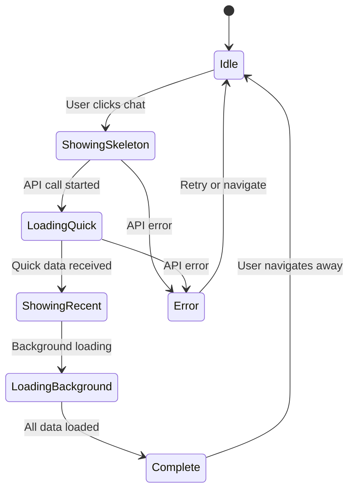

# Arquitetura Técnica - Otimização SensoChatPage

## 1. Arquitetura de Solução



## 2. Tecnologias e Dependências

- **Frontend:** React@18 + TypeScript + Tailwind CSS
- **UI Components:** shadcn/ui + Lucide React
- **State Management:** React useState + useEffect
- **Performance:** react-window (virtualização)
- **Backend:** Supabase (PostgreSQL)
- **Hooks Customizados:** useSmartScroll, useDebounce

## 3. Definições de Rotas

| Rota | Propósito | Otimizações |
|------|-----------|-------------|
| `/chat` | Chat inicial sem conversa | Skeleton mínimo, foco no input |
| `/chat/:conversationId` | Chat específico | Skeleton completo, carregamento incremental |

## 4. Definições de API

### 4.1 APIs Otimizadas

**Quick Context API (Nova)**
```typescript
GET /api/conversations/:id/quick-context
```

Request:
| Param | Type | Required | Description |
|-------|------|----------|-------------|
| id | string | true | ID da conversa |
| limit | number | false | Número de mensagens recentes (default: 10) |

Response:
| Param | Type | Description |
|-------|------|-------------|
| conversation | Conversation | Dados da conversa |
| recentMessages | ChatMessage[] | Últimas mensagens |
| hasMoreMessages | boolean | Se há mais mensagens para carregar |
| totalMessages | number | Total de mensagens na conversa |

Example:
```json
{
  "conversation": {
    "id": "conv-123",
    "title": "Chat sobre React",
    "user_id": "user-456"
  },
  "recentMessages": [...],
  "hasMoreMessages": true,
  "totalMessages": 45
}
```

**Background Loading API (Otimizada)**
```typescript
GET /api/conversations/:id/messages/remaining
```

Request:
| Param | Type | Required | Description |
|-------|------|----------|-------------|
| id | string | true | ID da conversa |
| skip | number | true | Número de mensagens já carregadas |
| limit | number | false | Limite de mensagens (default: 50) |

Response:
| Param | Type | Description |
|-------|------|-------------|
| messages | ChatMessage[] | Mensagens restantes |
| hasMore | boolean | Se há mais mensagens |

## 5. Arquitetura de Componentes



### 5.1 Novos Componentes

**ChatSkeleton Component**
```typescript
// src/components/ui/chat-skeleton.tsx
interface ChatSkeletonProps {
  messageCount?: number;
  showHeader?: boolean;
  variant?: 'full' | 'messages-only';
}

export function ChatSkeleton(props: ChatSkeletonProps): JSX.Element
```

**useSmartScroll Hook**
```typescript
// src/hooks/useSmartScroll.ts
interface SmartScrollReturn {
  scrollToLatest: (container: HTMLElement) => void;
  scrollToMessage: (messageId: string, container: HTMLElement) => void;
  isScrolling: boolean;
}

export function useSmartScroll(): SmartScrollReturn
```

### 5.2 Componentes Modificados

**SensoChatPage (Otimizado)**
- Implementação de skeleton loading
- Carregamento não-bloqueante
- Rolagem inteligente
- Estados de loading otimizados

**VirtualizedMessageList (Melhorado)**
- Threshold reduzido para ativação (10 mensagens)
- Melhor integração com skeleton
- Performance otimizada

## 6. Modelo de Dados

### 6.1 Estados de Loading



### 6.2 Performance Metrics

```typescript
interface PerformanceMetrics {
  timeToSkeleton: number;        // Tempo até mostrar skeleton
  timeToFirstMessage: number;    // Tempo até primeira mensagem
  timeToComplete: number;        // Tempo até carregamento completo
  scrollPerformance: number;     // Tempo de rolagem
}
```

## 7. Fluxo de Dados Otimizado

### 7.1 Carregamento de Chat



### 7.2 Estados de Transição



## 8. Otimizações de Performance

### 8.1 Lazy Loading Strategy

```typescript
// Implementação de carregamento incremental
const useIncrementalLoading = (conversationId: string) => {
  const [loadedMessages, setLoadedMessages] = useState<ChatMessage[]>([]);
  const [isLoading, setIsLoading] = useState(false);
  const [hasMore, setHasMore] = useState(true);
  
  const loadMore = useCallback(async () => {
    if (isLoading || !hasMore) return;
    
    setIsLoading(true);
    try {
      const result = await chatService.getMessagesIncremental(
        conversationId,
        loadedMessages.length
      );
      
      setLoadedMessages(prev => [...prev, ...result.messages]);
      setHasMore(result.hasMore);
    } finally {
      setIsLoading(false);
    }
  }, [conversationId, loadedMessages.length, isLoading, hasMore]);
  
  return { loadedMessages, loadMore, isLoading, hasMore };
};
```

### 8.2 Memory Management

```typescript
// Limpeza de memória para conversas grandes
const useMessageCleanup = (messages: ChatMessage[], maxMessages = 100) => {
  return useMemo(() => {
    if (messages.length <= maxMessages) return messages;
    
    // Manter primeiras 20 e últimas 80 mensagens
    const start = messages.slice(0, 20);
    const end = messages.slice(-80);
    
    return [...start, ...end];
  }, [messages, maxMessages]);
};
```

### 8.3 Scroll Performance

```typescript
// Otimização de rolagem com throttling
const useOptimizedScroll = () => {
  const scrollTimeoutRef = useRef<NodeJS.Timeout>();
  
  const scrollToPosition = useCallback((element: HTMLElement, position: number) => {
    // Cancelar scroll anterior se ainda executando
    if (scrollTimeoutRef.current) {
      clearTimeout(scrollTimeoutRef.current);
    }
    
    // Usar requestAnimationFrame para performance
    requestAnimationFrame(() => {
      element.scrollTo({
        top: position,
        behavior: 'smooth'
      });
    });
  }, []);
  
  return { scrollToPosition };
};
```

## 9. Monitoramento e Métricas

### 9.1 Performance Tracking

```typescript
// Hook para tracking de performance
const usePerformanceTracking = () => {
  const trackLoadTime = useCallback((eventName: string, startTime: number) => {
    const endTime = performance.now();
    const duration = endTime - startTime;
    
    // Log para análise
    logger.info(`Performance: ${eventName}`, {
      duration: `${duration.toFixed(2)}ms`,
      timestamp: new Date().toISOString()
    });
    
    // Enviar métricas se necessário
    if (duration > 1000) {
      logger.warn(`Slow performance detected: ${eventName}`, { duration });
    }
  }, []);
  
  return { trackLoadTime };
};
```

### 9.2 Error Boundaries

```typescript
// Error boundary específico para performance
class PerformanceErrorBoundary extends React.Component {
  componentDidCatch(error: Error, errorInfo: React.ErrorInfo) {
    logger.error('Performance Error Boundary caught error:', {
      error: error.message,
      componentStack: errorInfo.componentStack
    });
    
    // Fallback para versão sem otimizações
    this.setState({ hasError: true, useBasicMode: true });
  }
}
```

## 10. Deployment e Rollback

### 10.1 Feature Flags

```typescript
// Sistema de feature flags para rollout gradual
const useFeatureFlags = () => {
  return {
    enableSkeletonLoading: true,
    enableIncrementalLoading: false, // Rollout gradual
    enableSmartScroll: true,
    enablePerformanceTracking: true
  };
};
```

### 10.2 Rollback Strategy

- **Fase 1:** Deploy com feature flags desabilitadas
- **Fase 2:** Ativar skeleton loading para 10% dos usuários
- **Fase 3:** Ativar para 50% se métricas positivas
- **Fase 4:** Rollout completo ou rollback se problemas

Esta arquitetura garante implementação segura e monitorada das otimizações de performance.