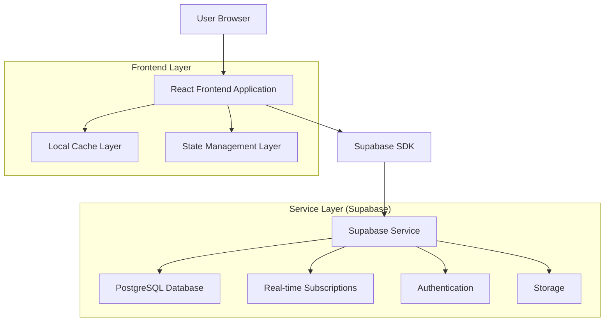
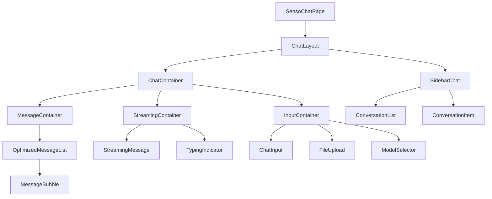
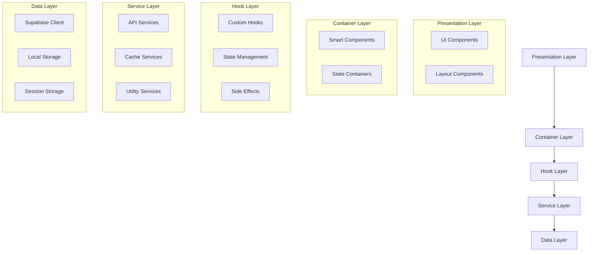
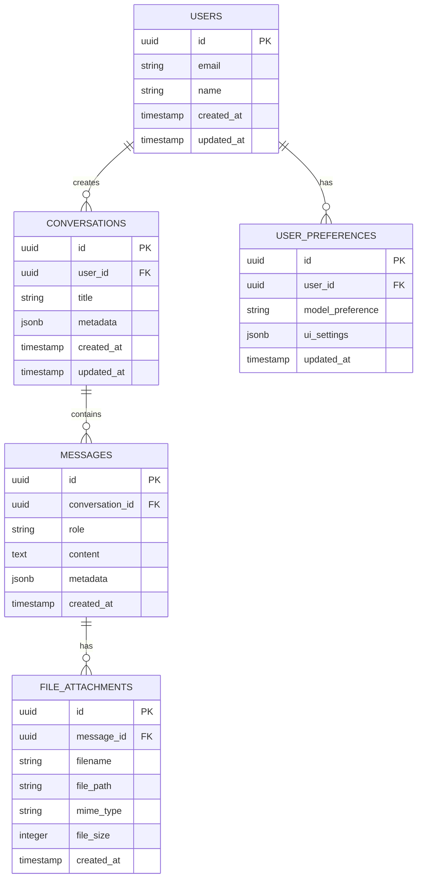

# Arquitetura Técnica - Refatoração SensoChat

## 1. Arquitetura Geral



## 2. Descrição das Tecnologias

- **Frontend**: React@18 + TypeScript + Tailwind CSS + shadcn/ui + Vite
- **Backend**: Supabase (PostgreSQL, Auth, Storage, Real-time)
- **State Management**: Custom hooks + React Context
- **Caching**: React Query + Local Storage
- **Testing**: Vitest + React Testing Library
- **Performance**: React.memo + useMemo + useCallback

## 3. Definições de Rotas

| Rota | Propósito | Componente Principal |
|------|-----------|---------------------|
| `/chat` | Página principal do chat | `SensoChatPage` |
| `/chat/:conversationId` | Chat com conversa específica | `SensoChatPage` |
| `/chat/new` | Iniciar nova conversa | `SensoChatPage` |

## 4. Arquitetura de Componentes

### 4.1 Estrutura Hierárquica



### 4.2 Camadas de Abstração



## 5. APIs e Interfaces

### 5.1 Hooks Principais

```typescript
// State Management Hook
interface ChatState {
  loading: LoadingState;
  ui: UIState;
  data: DataState;
  error: ErrorState;
}

interface ChatActions {
  sendMessage: (content: string, files?: File[]) => Promise<void>;
  loadConversation: (id: string) => Promise<void>;
  createConversation: () => Promise<string>;
  updateUI: (updates: Partial<UIState>) => void;
  clearError: () => void;
}

export const useChatState = (): {
  state: ChatState;
  actions: ChatActions;
} => {
  // Implementation
};
```

### 5.2 Service Interfaces

```typescript
// Chat Service Interface
interface IChatService {
  sendMessage(request: ChatRequest): Promise<ChatResponse>;
  streamMessage(request: ChatRequest): AsyncGenerator<string>;
  loadMessages(conversationId: string, cursor?: string): Promise<PaginatedMessages>;
  uploadFile(file: File): Promise<FileAttachment>;
  createConversation(title?: string): Promise<Conversation>;
  deleteConversation(id: string): Promise<void>;
}

// Cache Service Interface
interface ICacheService {
  get<T>(key: string): T | null;
  set<T>(key: string, value: T, ttl?: number): void;
  invalidate(pattern: string): void;
  clear(): void;
}
```

### 5.3 Component Props Interfaces

```typescript
// Base Component Props
interface BaseComponentProps {
  className?: string;
  testId?: string;
  loading?: boolean;
  error?: Error | null;
  onError?: (error: Error) => void;
}

// Message Component Props
interface MessageProps extends BaseComponentProps {
  message: ChatMessage;
  isStreaming?: boolean;
  onAction?: (action: MessageAction) => void;
}

// Container Component Props
interface ContainerProps extends BaseComponentProps {
  children: React.ReactNode;
  state: ChatState;
  actions: ChatActions;
}
```

## 6. Modelo de Dados

### 6.1 Diagrama ER



### 6.2 Definições DDL

```sql
-- Tabela de conversas otimizada
CREATE TABLE conversations (
    id UUID PRIMARY KEY DEFAULT gen_random_uuid(),
    user_id UUID NOT NULL,
    title VARCHAR(255),
    metadata JSONB DEFAULT '{}',
    message_count INTEGER DEFAULT 0,
    last_message_at TIMESTAMP WITH TIME ZONE,
    created_at TIMESTAMP WITH TIME ZONE DEFAULT NOW(),
    updated_at TIMESTAMP WITH TIME ZONE DEFAULT NOW()
);

-- Índices para performance
CREATE INDEX idx_conversations_user_id ON conversations(user_id);
CREATE INDEX idx_conversations_updated_at ON conversations(updated_at DESC);
CREATE INDEX idx_conversations_last_message ON conversations(last_message_at DESC);

-- Tabela de mensagens otimizada
CREATE TABLE messages (
    id UUID PRIMARY KEY DEFAULT gen_random_uuid(),
    conversation_id UUID NOT NULL REFERENCES conversations(id) ON DELETE CASCADE,
    role VARCHAR(20) NOT NULL CHECK (role IN ('user', 'assistant', 'system')),
    content TEXT NOT NULL,
    metadata JSONB DEFAULT '{}',
    token_count INTEGER,
    created_at TIMESTAMP WITH TIME ZONE DEFAULT NOW()
);

-- Índices para mensagens
CREATE INDEX idx_messages_conversation_id ON messages(conversation_id);
CREATE INDEX idx_messages_created_at ON messages(created_at DESC);
CREATE INDEX idx_messages_role ON messages(role);

-- Tabela de anexos
CREATE TABLE file_attachments (
    id UUID PRIMARY KEY DEFAULT gen_random_uuid(),
    message_id UUID NOT NULL REFERENCES messages(id) ON DELETE CASCADE,
    filename VARCHAR(255) NOT NULL,
    file_path VARCHAR(500) NOT NULL,
    mime_type VARCHAR(100) NOT NULL,
    file_size INTEGER NOT NULL,
    metadata JSONB DEFAULT '{}',
    created_at TIMESTAMP WITH TIME ZONE DEFAULT NOW()
);

-- Índices para anexos
CREATE INDEX idx_file_attachments_message_id ON file_attachments(message_id);
CREATE INDEX idx_file_attachments_mime_type ON file_attachments(mime_type);

-- Preferências do usuário
CREATE TABLE user_preferences (
    id UUID PRIMARY KEY DEFAULT gen_random_uuid(),
    user_id UUID NOT NULL UNIQUE,
    model_preference VARCHAR(50) DEFAULT 'gpt-4',
    ui_settings JSONB DEFAULT '{}',
    notification_settings JSONB DEFAULT '{}',
    updated_at TIMESTAMP WITH TIME ZONE DEFAULT NOW()
);

-- Políticas RLS (Row Level Security)
ALTER TABLE conversations ENABLE ROW LEVEL SECURITY;
ALTER TABLE messages ENABLE ROW LEVEL SECURITY;
ALTER TABLE file_attachments ENABLE ROW LEVEL SECURITY;
ALTER TABLE user_preferences ENABLE ROW LEVEL SECURITY;

-- Políticas de acesso
CREATE POLICY "Users can view own conversations" ON conversations
    FOR SELECT USING (auth.uid() = user_id);

CREATE POLICY "Users can insert own conversations" ON conversations
    FOR INSERT WITH CHECK (auth.uid() = user_id);

CREATE POLICY "Users can update own conversations" ON conversations
    FOR UPDATE USING (auth.uid() = user_id);

CREATE POLICY "Users can delete own conversations" ON conversations
    FOR DELETE USING (auth.uid() = user_id);

-- Função para atualizar timestamp
CREATE OR REPLACE FUNCTION update_updated_at_column()
RETURNS TRIGGER AS $$
BEGIN
    NEW.updated_at = NOW();
    RETURN NEW;
END;
$$ language 'plpgsql';

-- Triggers para atualização automática
CREATE TRIGGER update_conversations_updated_at
    BEFORE UPDATE ON conversations
    FOR EACH ROW EXECUTE FUNCTION update_updated_at_column();

CREATE TRIGGER update_user_preferences_updated_at
    BEFORE UPDATE ON user_preferences
    FOR EACH ROW EXECUTE FUNCTION update_updated_at_column();

-- Função para atualizar contador de mensagens
CREATE OR REPLACE FUNCTION update_conversation_message_count()
RETURNS TRIGGER AS $$
BEGIN
    IF TG_OP = 'INSERT' THEN
        UPDATE conversations 
        SET message_count = message_count + 1,
            last_message_at = NEW.created_at
        WHERE id = NEW.conversation_id;
        RETURN NEW;
    ELSIF TG_OP = 'DELETE' THEN
        UPDATE conversations 
        SET message_count = message_count - 1
        WHERE id = OLD.conversation_id;
        RETURN OLD;
    END IF;
    RETURN NULL;
END;
$$ language 'plpgsql';

-- Trigger para contador de mensagens
CREATE TRIGGER update_message_count
    AFTER INSERT OR DELETE ON messages
    FOR EACH ROW EXECUTE FUNCTION update_conversation_message_count();

-- Dados iniciais
INSERT INTO user_preferences (user_id, model_preference, ui_settings)
SELECT 
    auth.uid(),
    'gpt-4',
    '{
        "theme": "light",
        "fontSize": "medium",
        "autoScroll": true,
        "showTimestamps": false
    }'::jsonb
WHERE NOT EXISTS (
    SELECT 1 FROM user_preferences WHERE user_id = auth.uid()
);
```

## 7. Otimizações de Performance

### 7.1 Estratégias de Caching

```typescript
// Cache Strategy Implementation
class ChatCacheStrategy {
  private static readonly CACHE_KEYS = {
    CONVERSATIONS: 'conversations',
    MESSAGES: 'messages',
    USER_PREFS: 'user_preferences'
  } as const;
  
  static getCacheKey(type: keyof typeof this.CACHE_KEYS, id?: string): string {
    return id ? `${this.CACHE_KEYS[type]}:${id}` : this.CACHE_KEYS[type];
  }
  
  static shouldCache(data: any): boolean {
    return data && Object.keys(data).length > 0;
  }
  
  static getTTL(type: keyof typeof this.CACHE_KEYS): number {
    const ttls = {
      CONVERSATIONS: 5 * 60 * 1000, // 5 minutes
      MESSAGES: 10 * 60 * 1000,     // 10 minutes
      USER_PREFS: 30 * 60 * 1000    // 30 minutes
    };
    return ttls[type];
  }
}
```

### 7.2 Lazy Loading Implementation

```typescript
// Lazy Loading Hook
export const useLazyMessages = (conversationId: string) => {
  const [messages, setMessages] = useState<ChatMessage[]>([]);
  const [loading, setLoading] = useState(false);
  const [hasMore, setHasMore] = useState(true);
  const [cursor, setCursor] = useState<string | null>(null);
  
  const loadMore = useCallback(async () => {
    if (loading || !hasMore) return;
    
    setLoading(true);
    try {
      const result = await chatService.loadMessages(conversationId, cursor);
      
      setMessages(prev => {
        const newMessages = result.messages.filter(
          msg => !prev.some(existing => existing.id === msg.id)
        );
        return [...prev, ...newMessages];
      });
      
      setCursor(result.nextCursor);
      setHasMore(result.hasMore);
    } catch (error) {
      console.error('Failed to load messages:', error);
    } finally {
      setLoading(false);
    }
  }, [conversationId, cursor, loading, hasMore]);
  
  return { messages, loading, hasMore, loadMore };
};
```

### 7.3 Memoization Strategy

```typescript
// Memoized Components
const MemoizedMessageBubble = memo(({ message, isStreaming }: MessageProps) => {
  const renderedContent = useMemo(() => {
    return renderMarkdown(message.content);
  }, [message.content]);
  
  return (
    <div className="message-bubble">
      {renderedContent}
      {isStreaming && <TypingIndicator />}
    </div>
  );
}, (prevProps, nextProps) => {
  return (
    prevProps.message.id === nextProps.message.id &&
    prevProps.message.content === nextProps.message.content &&
    prevProps.isStreaming === nextProps.isStreaming
  );
});
```

## 8. Monitoramento e Observabilidade

### 8.1 Performance Metrics

```typescript
// Performance Monitoring
class PerformanceTracker {
  private static metrics = new Map<string, number[]>();
  
  static startTimer(operation: string): () => void {
    const start = performance.now();
    