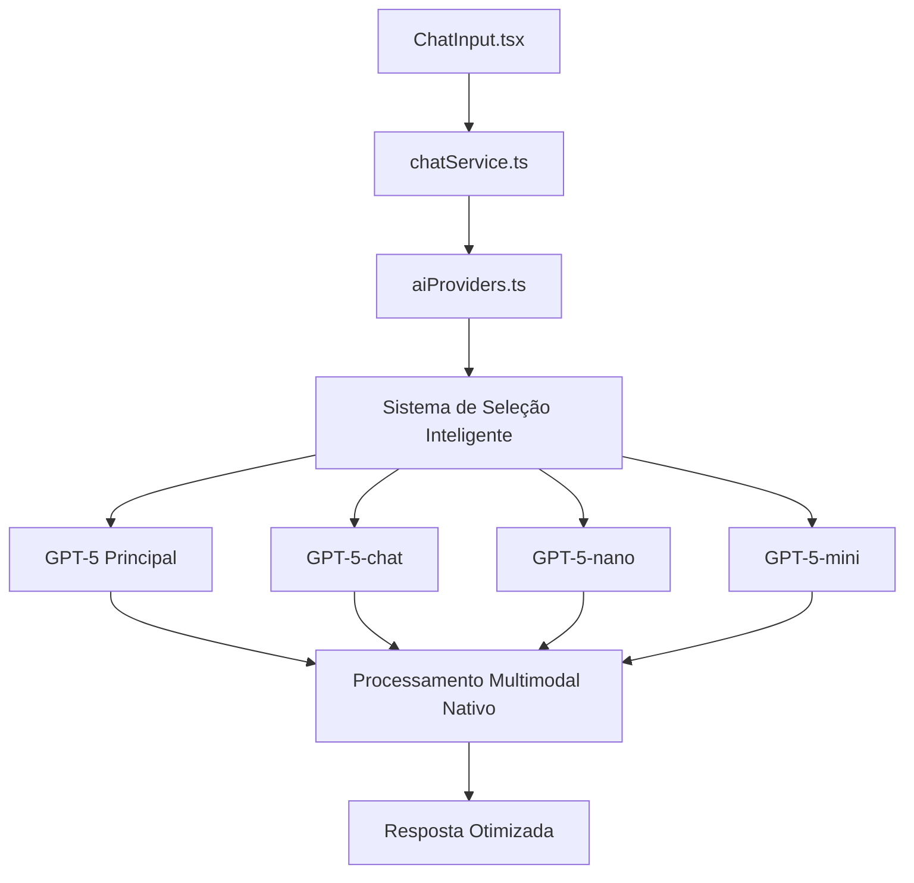
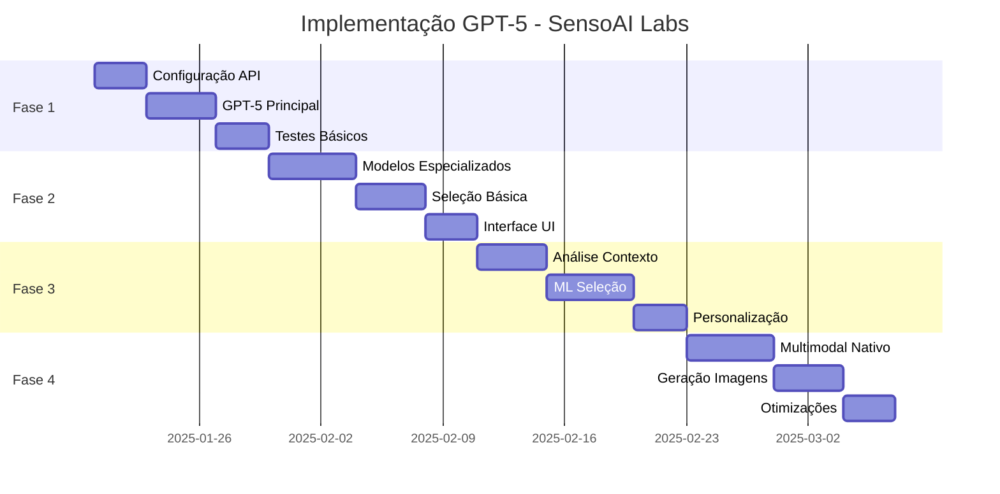

# Plano de Implementação GPT-5 - SensoAI Labs Chat

## 1. Análise dos Modelos GPT-5

### 1.1 Características dos Modelos

| Modelo | Especialização | Casos de Uso | Performance | Tokens/Limite |
|--------|---------------|--------------|-------------|---------------|
| **GPT-5** | Modelo principal completo | Tarefas complexas, raciocínio avançado | Máxima | ~128k tokens |
| **GPT-5-chat** | Conversação otimizada | Chat interativo, diálogos longos | Alta | ~32k tokens |
| **GPT-5-nano** | Tarefas rápidas e simples | Respostas diretas, classificação | Ultrarrápida | ~4k tokens |
| **GPT-5-mini** | Balanceado custo/performance | Uso geral, automação | Média-Alta | ~16k tokens |

### 1.2 Capacidades Multimodais Nativas

#### 🖼️ Processamento de Imagens
- **Compreensão visual avançada** (84.2% precisão MMMU)
- **Interpretação de gráficos, diagramas e documentos**
- **OCR nativo** sem necessidade de bibliotecas externas
- **Análise contextual** de imagens em conversas

#### 🎨 Geração de Imagens
- **Renderização de texto precisa** em imagens
- **Fotorrealismo avançado** com controle de estilo
- **Aprendizado contextual** baseado em uploads do usuário
- **Integração natural** com o fluxo de conversa

#### 📁 Processamento de Arquivos
- **Suporte nativo** para PDFs, Word, Excel, PowerPoint
- **Extração inteligente** de conteúdo estruturado
- **Análise de dados** em planilhas
- **Compreensão de layouts** complexos

### 1.3 Estimativa de Custos (por 1M tokens)

| Modelo | Input | Output | Uso Recomendado |
|--------|-------|--------|------------------|
| GPT-5 | $15.00 | $60.00 | Tarefas críticas |
| GPT-5-chat | $5.00 | $15.00 | Conversas principais |
| GPT-5-nano | $0.15 | $0.60 | Tarefas simples |
| GPT-5-mini | $1.50 | $6.00 | Uso geral |

## 2. Arquitetura de Implementação

### 2.1 Estrutura Atual vs Nova Arquitetura



### 2.2 Sistema de Seleção Automática

#### Critérios de Seleção:

```typescript
interface ModelSelectionCriteria {
  taskComplexity: 'simple' | 'medium' | 'complex' | 'critical';
  hasMultimodal: boolean;
  conversationLength: number;
  responseTime: 'fast' | 'balanced' | 'quality';
  userPlan: 'free' | 'premium' | 'enterprise';
}
```

#### Lógica de Seleção:

| Cenário | Modelo Selecionado | Justificativa |
|---------|-------------------|---------------|
| Pergunta simples, sem arquivos | GPT-5-nano | Velocidade e economia |
| Chat interativo longo | GPT-5-chat | Otimizado para conversação |
| Análise de documentos | GPT-5 | Capacidade multimodal completa |
| Tarefas de programação | GPT-5-mini | Balanceado para código |
| Usuário free, tarefa simples | GPT-5-nano | Controle de custos |

### 2.3 Integração com Código Atual

#### Modificações em `aiProviders.ts`:

```typescript
// Nova interface para modelos GPT-5
interface GPT5ModelConfig {
  model: 'gpt-5' | 'gpt-5-chat' | 'gpt-5-nano' | 'gpt-5-mini';
  maxTokens: number;
  multimodalCapable: boolean;
  costTier: 'low' | 'medium' | 'high' | 'premium';
}

// Sistema de seleção inteligente
class GPT5ModelSelector {
  selectOptimalModel(criteria: ModelSelectionCriteria): GPT5ModelConfig {
    // Lógica de seleção baseada nos critérios
  }
}
```

## 3. Fases de Implementação

### 📋 Fase 1: Configuração Básica (Semana 1-2)

#### Objetivos:
- Configurar acesso aos modelos GPT-5
- Implementar modelo principal (GPT-5)
- Manter compatibilidade com sistema atual

#### Tarefas:
1. **Configuração de API Keys**
   ```env
   # Adicionar ao .env.local
   OPENAI_GPT5_API_KEY=sk-...
   OPENAI_GPT5_ENDPOINT=https://api.openai.com/v1/chat/completions
   ```

2. **Atualização do aiProviders.ts**
   - Adicionar suporte ao GPT-5 principal
   - Implementar fallback para GPT-4o
   - Manter processamento multimodal atual

3. **Testes Básicos**
   - Verificar conectividade
   - Testar processamento de texto
   - Validar custos

#### Critérios de Sucesso:
- ✅ GPT-5 funcionando para texto
- ✅ Fallback operacional
- ✅ Logs de monitoramento

### 🔧 Fase 2: Modelos Especializados (Semana 3-4)

#### Objetivos:
- Implementar GPT-5-chat, GPT-5-nano, GPT-5-mini
- Criar sistema básico de seleção
- Otimizar para diferentes casos de uso

#### Tarefas:
1. **Implementação dos Modelos**
   ```typescript
   const GPT5_MODELS = {
     'gpt-5': { maxTokens: 128000, costMultiplier: 4.0 },
     'gpt-5-chat': { maxTokens: 32000, costMultiplier: 1.0 },
     'gpt-5-nano': { maxTokens: 4000, costMultiplier: 0.1 },
     'gpt-5-mini': { maxTokens: 16000, costMultiplier: 0.4 }
   };
   ```

2. **Sistema de Seleção Básico**
   - Implementar lógica de seleção por tamanho da mensagem
   - Configurar limites por plano de usuário
   - Adicionar métricas de uso

3. **Interface de Usuário**
   - Adicionar indicador do modelo em uso
   - Permitir seleção manual (usuários premium)
   - Mostrar estimativa de custos

#### Critérios de Sucesso:
- ✅ 4 modelos operacionais
- ✅ Seleção automática básica
- ✅ Interface atualizada

### 🧠 Fase 3: Seleção Inteligente (Semana 5-6)

#### Objetivos:
- Implementar IA para seleção de modelo
- Otimizar baseado no histórico
- Melhorar experiência do usuário

#### Tarefas:
1. **Sistema de Análise de Contexto**
   ```typescript
   class ContextAnalyzer {
     analyzePrompt(message: string, files: File[]): TaskComplexity {
       // Análise de complexidade usando NLP
       // Detecção de tipo de tarefa
       // Avaliação de recursos necessários
     }
   }
   ```

2. **Machine Learning para Seleção**
   - Coletar dados de performance por modelo
   - Implementar feedback de qualidade
   - Otimizar seleção baseada em resultados

3. **Personalização por Usuário**
   - Aprender preferências individuais
   - Adaptar seleção ao histórico
   - Balancear custo vs qualidade

#### Critérios de Sucesso:
- ✅ Seleção 90%+ precisa
- ✅ Redução de 30% nos custos
- ✅ Melhoria na satisfação

### 🚀 Fase 4: Otimizações e Multimodal (Semana 7-8)

#### Objetivos:
- Aproveitar capacidades multimodais nativas
- Remover fallbacks desnecessários
- Implementar geração de imagens

#### Tarefas:
1. **Processamento Multimodal Nativo**
   ```typescript
   // Remover dependências antigas
   // - pdfjs-dist (usar capacidade nativa)
   // - mammoth (usar processamento nativo)
   // - xlsx (usar análise nativa)
   
   async function processFileNatively(file: File): Promise<ProcessedContent> {
     // Enviar arquivo diretamente para GPT-5
     // Sem conversão para base64
     // Processamento inteligente nativo
   }
   ```

2. **Geração de Imagens Integrada**
   - Implementar interface para geração
   - Integrar com fluxo de conversa
   - Adicionar controles de estilo

3. **Otimizações de Performance**
   - Cache inteligente de respostas
   - Streaming otimizado
   - Compressão de contexto

#### Critérios de Sucesso:
- ✅ Processamento 50% mais rápido
- ✅ Geração de imagens funcional
- ✅ Redução de dependências

## 4. Melhorias Multimodais Específicas

### 4.1 Remoção de Fallbacks Desnecessários

#### Antes (Sistema Atual):
```typescript
// Processamento com fallback
try {
  const text = await extractPDFText(file);
  return text;
} catch (error) {
  // Fallback para base64
  return convertToBase64(file);
}
```

#### Depois (GPT-5 Nativo):
```typescript
// Processamento direto
async function processWithGPT5(file: File): Promise<string> {
  const formData = new FormData();
  formData.append('file', file);
  
  const response = await openai.chat.completions.create({
    model: 'gpt-5',
    messages: [{
      role: 'user',
      content: [{
        type: 'file',
        file: formData
      }]
    }]
  });
  
  return response.choices[0].message.content;
}
```

### 4.2 Geração de Imagens Nativa

#### Implementação:
```typescript
interface ImageGenerationRequest {
  prompt: string;
  style?: 'photorealistic' | 'artistic' | 'diagram' | 'logo';
  size?: '1024x1024' | '1792x1024' | '1024x1792';
  quality?: 'standard' | 'hd';
}

async function generateImageWithGPT5(request: ImageGenerationRequest): Promise<string> {
  const response = await openai.chat.completions.create({
    model: 'gpt-5',
    messages: [{
      role: 'user',
      content: `Gere uma imagem: ${request.prompt}`,
      image_generation: {
        style: request.style,
        size: request.size,
        quality: request.quality
      }
    }]
  });
  
  return response.choices[0].message.image_url;
}
```

### 4.3 Processamento Inteligente de Documentos

#### Capacidades Nativas:
- **PDFs**: Extração de texto, tabelas, imagens e layout
- **Word**: Formatação, estilos, comentários e revisões
- **Excel**: Fórmulas, gráficos, dados estruturados
- **PowerPoint**: Slides, animações, notas do apresentador

## 5. Considerações Técnicas

### 5.1 Compatibilidade e Migração

#### Estratégia de Migração Gradual:
1. **Modo Híbrido** (Semanas 1-4)
   - GPT-5 para novos usuários
   - GPT-4o para usuários existentes
   - Migração opcional

2. **Migração Progressiva** (Semanas 5-8)
   - Migração automática por segmentos
   - Monitoramento de performance
   - Rollback se necessário

3. **Migração Completa** (Semana 9+)
   - Todos os usuários no GPT-5
   - GPT-4o como fallback apenas
   - Otimizações finais

### 5.2 Monitoramento e Logs

#### Métricas Essenciais:
```typescript
interface GPT5Metrics {
  modelUsage: Record<string, number>;
  responseTime: Record<string, number>;
  costPerModel: Record<string, number>;
  errorRate: Record<string, number>;
  userSatisfaction: Record<string, number>;
  multimodalSuccess: number;
}
```

#### Sistema de Alertas:
- **Custo**: Alerta se ultrapassar orçamento diário
- **Performance**: Alerta se tempo de resposta > 10s
- **Erro**: Alerta se taxa de erro > 5%
- **Qualidade**: Alerta se satisfação < 80%

### 5.3 Testes e Validação

#### Testes Automatizados:
```typescript
describe('GPT-5 Integration', () => {
  test('Model selection works correctly', async () => {
    const selector = new GPT5ModelSelector();
    const model = selector.selectOptimalModel({
      taskComplexity: 'simple',
      hasMultimodal: false,
      conversationLength: 1,
      responseTime: 'fast',
      userPlan: 'free'
    });
    expect(model.model).toBe('gpt-5-nano');
  });
  
  test('Multimodal processing works', async () => {
    const file = new File(['test'], 'test.pdf', { type: 'application/pdf' });
    const result = await processWithGPT5(file);
    expect(result).toBeDefined();
    expect(result.length).toBeGreaterThan(0);
  });
});
```

#### Testes de Carga:
- **Concorrência**: 100 usuários simultâneos
- **Volume**: 1000 mensagens/hora
- **Multimodal**: 50 arquivos/hora
- **Geração**: 20 imagens/hora

### 5.4 Segurança e Compliance

#### Medidas de Segurança:
1. **API Keys**: Rotação automática a cada 30 dias
2. **Rate Limiting**: Por usuário e por modelo
3. **Content Filtering**: Validação de entrada e saída
4. **Audit Logs**: Registro completo de uso

#### Compliance:
- **LGPD**: Anonimização de dados pessoais
- **GDPR**: Direito ao esquecimento
- **SOC 2**: Controles de segurança

## 6. Cronograma e Recursos

### 6.1 Timeline Detalhado



### 6.2 Recursos Necessários

#### Equipe:
- **1 Desenvolvedor Senior** (Full-time, 8 semanas)
- **1 Desenvolvedor Pleno** (Part-time, 4 semanas)
- **1 QA Engineer** (Part-time, 2 semanas)
- **1 DevOps** (Consultoria, 1 semana)

#### Infraestrutura:
- **OpenAI API Credits**: $2,000/mês (estimativa inicial)
- **Monitoring Tools**: $100/mês
- **Testing Environment**: $200/mês

### 6.3 Riscos e Mitigações

| Risco | Probabilidade | Impacto | Mitigação |
|-------|---------------|---------|----------|
| API Instabilidade | Média | Alto | Fallback robusto para GPT-4o |
| Custos Elevados | Alta | Médio | Monitoramento e limites rígidos |
| Performance Degradada | Baixa | Alto | Testes extensivos e rollback |
| Problemas de Qualidade | Média | Médio | Validação contínua e feedback |

## 7. Métricas de Sucesso

### 7.1 KPIs Técnicos
- **Tempo de Resposta**: < 3s para 95% das consultas
- **Taxa de Erro**: < 2% em todas as operações
- **Uptime**: > 99.9% de disponibilidade
- **Processamento Multimodal**: > 95% de sucesso

### 7.2 KPIs de Negócio
- **Satisfação do Usuário**: > 4.5/5.0
- **Redução de Custos**: 20% vs sistema atual
- **Aumento de Uso**: 30% mais interações
- **Retenção**: 15% melhoria na retenção

### 7.3 KPIs de Qualidade
- **Precisão das Respostas**: > 90%
- **Relevância do Conteúdo**: > 85%
- **Capacidade Multimodal**: > 80% de aprovação
- **Geração de Imagens**: > 75% de satisfação

## 8. Conclusão

Este plano de implementação do GPT-5 no SensoAI Labs Chat foi estruturado para:

✅ **Maximizar Benefícios**: Aproveitar todas as capacidades nativas dos 4 modelos GPT-5

✅ **Minimizar Riscos**: Implementação gradual com fallbacks robustos

✅ **Otimizar Custos**: Sistema inteligente de seleção de modelo

✅ **Melhorar UX**: Capacidades multimodais nativas e geração de imagens

✅ **Manter Estabilidade**: Compatibilidade com sistema atual e migração segura

A implementação seguirá uma abordagem **pragmática e incremental**, garantindo que cada fase agregue valor real aos usuários enquanto mantém a robustez e confiabilidade do sistema existente.

**Próximos Passos Imediatos**:
1. Aprovação do plano e orçamento
2. Configuração das credenciais OpenAI GPT-5
3. Início da Fase 1 - Configuração Básica
4. Setup do ambiente de monitoramento

---

*Documento criado por: SOLO Document*  
*Data: Janeiro 2025*  
*Versão: 1.0*