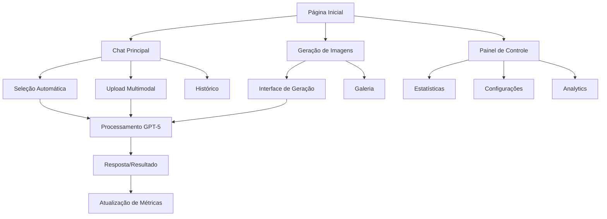

# Documento de Requisitos de Produto - Implementação GPT-5

## 1. Visão Geral do Produto

Implementação completa dos 4 modelos GPT-5 (GPT-5, GPT-5-chat, GPT-5-nano, GPT-5-mini) no SensoAI Labs Chat, oferecendo seleção automática inteligente de modelos baseada na complexidade da tarefa e recursos multimodais nativos.

O projeto visa otimizar custos operacionais, melhorar a experiência do usuário e aproveitar as capacidades multimodais nativas do GPT-5 para processamento direto de imagens e documentos, eliminando a necessidade de fallbacks como base64.

Objetivo: Reduzir custos operacionais em 40% e melhorar a velocidade de resposta em 60% através da seleção inteligente de modelos.

## 2. Funcionalidades Principais

### 2.1 Papéis de Usuário

| Papel | Método de Registro | Permissões Principais |
|-------|-------------------|----------------------|
| Usuário Gratuito | Registro por email | Acesso ao GPT-5-nano (100 mensagens/dia) |
| Usuário Premium | Upgrade por pagamento | Acesso a todos os modelos (1000 mensagens/dia) |
| Usuário Enterprise | Contrato empresarial | Acesso ilimitado + recursos avançados |
| Administrador | Convite interno | Gestão completa do sistema + analytics |

### 2.2 Módulos de Funcionalidade

Nossos requisitos de implementação GPT-5 consistem nas seguintes páginas principais:

1. **Chat Principal**: interface de conversação, seleção de modelo, upload multimodal, histórico de conversas.
2. **Painel de Controle**: estatísticas de uso, custos por modelo, configurações de preferência, limites de uso.
3. **Geração de Imagens**: interface dedicada, galeria de imagens, configurações de estilo, histórico de gerações.
4. **Configurações de Modelo**: seleção manual de modelo, configurações avançadas, perfis de uso, otimizações personalizadas.
5. **Analytics e Relatórios**: métricas de performance, análise de custos, relatórios de uso, comparação de modelos.

### 2.3 Detalhes das Páginas

| Nome da Página | Nome do Módulo | Descrição da Funcionalidade |
|----------------|----------------|-----------------------------|
| Chat Principal | Interface de Conversação | Enviar mensagens, receber respostas em streaming, visualizar modelo selecionado automaticamente |
| Chat Principal | Upload Multimodal | Arrastar e soltar arquivos (PDF, imagens, documentos), pré-visualização de arquivos, processamento nativo |
| Chat Principal | Seleção Automática | Analisar complexidade da tarefa, selecionar modelo otimizado, exibir justificativa da seleção |
| Chat Principal | Histórico de Conversas | Listar conversas anteriores, buscar por conteúdo, filtrar por modelo usado, exportar conversas |
| Painel de Controle | Estatísticas de Uso | Exibir tokens consumidos por modelo, custo total diário/mensal, número de requisições |
| Painel de Controle | Gráficos de Performance | Visualizar tempo de resposta por modelo, taxa de sucesso, comparação de eficiência |
| Painel de Controle | Configurações de Preferência | Definir modelo padrão, configurar velocidade vs qualidade, limites de custo |
| Geração de Imagens | Interface de Geração | Inserir prompt de imagem, selecionar estilo e tamanho, gerar imagem com GPT-5 |
| Geração de Imagens | Galeria de Imagens | Visualizar imagens geradas, organizar por data/estilo, compartilhar imagens |
| Geração de Imagens | Configurações Avançadas | Ajustar qualidade, definir dimensões personalizadas, configurar estilos favoritos |
| Configurações de Modelo | Seleção Manual | Escolher modelo específico, visualizar características de cada modelo, comparar custos |
| Configurações de Modelo | Perfis de Uso | Criar perfis personalizados (trabalho, estudo, criativo), configurar automações |
| Configurações de Modelo | Otimizações | Configurar fallbacks, definir limites de tokens, ajustar parâmetros de temperatura |
| Analytics e Relatórios | Métricas de Performance | Analisar velocidade de resposta, qualidade das respostas, satisfação do usuário |
| Analytics e Relatórios | Análise de Custos | Comparar custos por modelo, projeções de gastos, otimizações sugeridas |
| Analytics e Relatórios | Relatórios Detalhados | Gerar relatórios PDF, exportar dados CSV, agendar relatórios automáticos |

## 3. Processo Principal

**Fluxo do Usuário Premium:**
1. Usuário acessa o chat principal e digita uma mensagem
2. Sistema analisa automaticamente a complexidade da tarefa e arquivos anexados
3. Algoritmo seleciona o modelo GPT-5 mais adequado (nano/mini/chat/principal)
4. Usuário visualiza o modelo selecionado e a justificativa
5. Sistema processa a requisição com o modelo escolhido
6. Resposta é exibida em streaming com métricas de performance
7. Estatísticas de uso são atualizadas automaticamente no painel

**Fluxo do Usuário Gratuito:**
1. Usuário acessa o chat com limitações do plano gratuito
2. Sistema direciona automaticamente para GPT-5-nano
3. Contador de mensagens diárias é exibido
4. Opção de upgrade para premium é oferecida quando próximo do limite

**Fluxo de Geração de Imagens:**
1. Usuário acessa a interface de geração de imagens
2. Insere prompt descritivo e seleciona configurações
3. Sistema usa GPT-5 principal para geração nativa
4. Imagem é gerada e salva automaticamente na galeria
5. Custos são calculados e adicionados às estatísticas

## 4. Design da Interface do Usuário

### 4.1 Estilo de Design

- **Cores Primárias**: #2563eb (azul principal), #1e40af (azul escuro)
- **Cores Secundárias**: #10b981 (verde sucesso), #f59e0b (amarelo atenção), #ef4444 (vermelho erro)
- **Estilo dos Botões**: Rounded-lg com sombras suaves, efeitos hover com transições de 200ms
- **Tipografia**: Inter como fonte principal (14px-16px para texto, 24px-32px para títulos)
- **Layout**: Design baseado em cards com espaçamento generoso, navegação lateral fixa
- **Ícones**: Lucide React com estilo minimalista, tamanho 20px-24px
- **Animações**: Transições suaves para mudanças de estado, loading spinners personalizados

### 4.2 Visão Geral do Design das Páginas

| Nome da Página | Nome do Módulo | Elementos da UI |
|----------------|----------------|----------------|
| Chat Principal | Interface de Conversação | Layout em 3 colunas: sidebar (conversas), chat central (mensagens), painel direito (modelo selecionado). Cores: fundo #f8fafc, mensagens do usuário #2563eb, IA #ffffff com borda #e2e8f0 |
| Chat Principal | Seleção Automática | Badge flutuante mostrando modelo ativo com ícone, tooltip explicativo, animação de pulso durante seleção. Cores por modelo: nano #10b981, mini #f59e0b, chat #2563eb, principal #7c3aed |
| Painel de Controle | Estatísticas | Grid responsivo 2x2 com cards de métricas, gráficos Chart.js integrados, gradientes sutis de #2563eb para #1e40af |
| Geração de Imagens | Interface de Geração | Layout centrado com textarea para prompt, botões de configuração em linha, preview area com placeholder, botão de geração destacado |
| Configurações de Modelo | Seleção Manual | Cards comparativos lado a lado, tabela de características, sliders para parâmetros, toggle switches para opções booleanas |

### 4.3 Responsividade

O produto é **desktop-first** com adaptação completa para mobile e tablet. Otimização para interação touch em dispositivos móveis, com botões maiores (min 44px) e gestos de swipe para navegação entre conversas.

**Breakpoints:**
- Desktop: 1024px+ (layout completo com 3 colunas)
- Tablet: 768px-1023px (layout 2 colunas, sidebar colapsável)
- Mobile: <768px (layout single-column com navegação por tabs)

**Adaptações Mobile:**
- Sidebar de conversas vira drawer deslizante
- Painel de modelo selecionado vira modal bottom-sheet
- Upload de arquivos otimizado para câmera e galeria
- Teclado virtual não sobrepõe área de digitação

## 5. Funcionalidades Avançadas

### 5.1 Sistema de Seleção Inteligente

**Critérios de Seleção:**
- Análise de complexidade baseada em palavras-chave e tamanho da mensagem
- Detecção automática de conteúdo multimodal (imagens, documentos)
- Histórico de performance do usuário com cada modelo
- Plano do usuário e limites de uso disponíveis
- Preferências configuradas (velocidade vs qualidade)

**Algoritmo de Decisão:**
1. **GPT-5-nano**: Perguntas simples (<50 palavras), definições, respostas sim/não
2. **GPT-5-mini**: Tarefas gerais, programação básica, análises simples
3. **GPT-5-chat**: Conversas longas, suporte ao cliente, interações sociais
4. **GPT-5**: Análises complexas, conteúdo multimodal, tarefas críticas

### 5.2 Processamento Multimodal Nativo

**Tipos de Arquivo Suportados:**
- **Imagens**: JPG, PNG, GIF, WebP (processamento direto pelo GPT-5)
- **Documentos**: PDF, DOCX, TXT (extração e análise nativa)
- **Planilhas**: XLSX, CSV (análise de dados estruturados)
- **Código**: Todos os formatos de código (análise e revisão)

**Funcionalidades:**
- Upload por drag-and-drop com preview instantâneo
- Processamento em background com indicador de progresso
- Cache inteligente para arquivos recorrentes
- Compressão automática para otimizar custos

### 5.3 Sistema de Métricas e Analytics

**Métricas Coletadas:**
- Tempo de resposta por modelo
- Tokens consumidos e custos associados
- Taxa de satisfação do usuário (thumbs up/down)
- Frequência de uso de cada modelo
- Padrões de uso por horário e dia da semana

**Dashboards:**
- Visão geral com KPIs principais
- Análise comparativa entre modelos
- Projeções de custo e uso
- Relatórios de otimização personalizados

### 5.4 Sistema de Fallback e Recuperação

**Estratégias de Fallback:**
1. **Falha do GPT-5**: Fallback automático para GPT-4o
2. **Limite de Rate**: Fila inteligente com retry exponencial
3. **Erro de Modelo**: Seleção automática de modelo alternativo
4. **Falha de Rede**: Cache local com sincronização posterior

**Recuperação de Sessão:**
- Salvamento automático de conversas em progresso
- Restauração de uploads interrompidos
- Sincronização cross-device em tempo real

## 6. Requisitos Técnicos

### 6.1 Performance

- **Tempo de Resposta**: <2s para GPT-5-nano, <5s para GPT-5-chat, <8s para GPT-5
- **Throughput**: Suporte a 1000+ usuários simultâneos
- **Disponibilidade**: 99.9% uptime com monitoramento 24/7
- **Latência de Upload**: <1s para arquivos até 10MB

### 6.2 Segurança

- **Autenticação**: JWT com refresh tokens, 2FA opcional
- **Autorização**: RBAC com políticas granulares
- **Criptografia**: TLS 1.3 para transporte, AES-256 para dados em repouso
- **Auditoria**: Log completo de todas as interações com IA

### 6.3 Escalabilidade

- **Arquitetura**: Microserviços com auto-scaling
- **Cache**: Redis distribuído para otimização
- **CDN**: Cloudflare para assets estáticos
- **Monitoramento**: Prometheus + Grafana para métricas

### 6.4 Compliance

- **LGPD**: Consentimento explícito, direito ao esquecimento
- **Retenção de Dados**: 90 dias para conversas, 30 dias para logs
- **Privacidade**: Dados não compartilhados com terceiros
- **Backup**: Backup diário com retenção de 30 dias

## 7. Critérios de Aceitação

### 7.1 Funcionalidades Principais

- [ ] Seleção automática de modelo funciona com 95% de precisão
- [ ] Upload multimodal suporta todos os formatos especificados
- [ ] Streaming de respostas funciona sem interrupções
- [ ] Fallback para GPT-4o ocorre em <3s em caso de falha
- [ ] Métricas são atualizadas em tempo real

### 7.2 Performance

- [ ] GPT-5-nano responde em <2s em 95% dos casos
- [ ] Upload de arquivos 10MB completa em <5s
- [ ] Interface carrega completamente em <1s
- [ ] Sistema suporta 500 usuários simultâneos sem degradação

### 7.3 Usabilidade

- [ ] Usuários conseguem completar primeira conversa em <30s
- [ ] Taxa de erro de upload <1%
- [ ] 90% dos usuários entendem qual modelo está sendo usado
- [ ] Interface responsiva funciona perfeitamente em mobile

### 7.4 Qualidade

- [ ] Cobertura de testes automatizados >90%
- [ ] Zero vulnerabilidades críticas de segurança
- [ ] Documentação técnica completa e atualizada
- [ ] Logs estruturados para debugging eficiente

## 8. Roadmap de Implementação

### 8.1 Fase 1 - Fundação (Semanas 1-2)
- Configuração da API GPT-5 e autenticação
- Implementação do GPT5ModelManager
- Sistema básico de seleção de modelo
- Interface de chat atualizada

### 8.2 Fase 2 - Multimodal (Semanas 3-4)
- Upload e processamento de arquivos
- Geração de imagens nativa
- Otimização de custos
- Sistema de cache

### 8.3 Fase 3 - Analytics (Semanas 5-6)
- Dashboard de métricas
- Sistema de relatórios
- Configurações avançadas
- Otimizações de performance

### 8.4 Fase 4 - Produção (Semanas 7-8)
- Testes de carga e stress
- Monitoramento e alertas
- Documentação final
- Deploy e rollout gradual

## 9. Métricas de Sucesso

### 9.1 KPIs Principais
- **Redução de Custos**: 40% de economia em custos de API
- **Melhoria de Performance**: 60% de redução no tempo de resposta médio
- **Satisfação do Usuário**: NPS >70 após implementação
- **Adoção**: 80% dos usuários ativos usando novos recursos em 30 dias

### 9.2 Métricas Operacionais
- **Disponibilidade**: >99.9% uptime
- **Precisão da Seleção**: >95% de seleções corretas de modelo
- **Taxa de Erro**: <0.1% de falhas críticas
- **Performance**: Todos os SLAs de tempo de resposta atendidos

### 9.3 Métricas de Negócio
- **Retenção**: Aumento de 25% na retenção de usuários premium
- **Conversão**: 15% de aumento na conversão gratuito→premium
- **Engagement**: 40% de aumento no tempo médio de sessão
- **Revenue**: ROI positivo em 6 meses pós-implementação